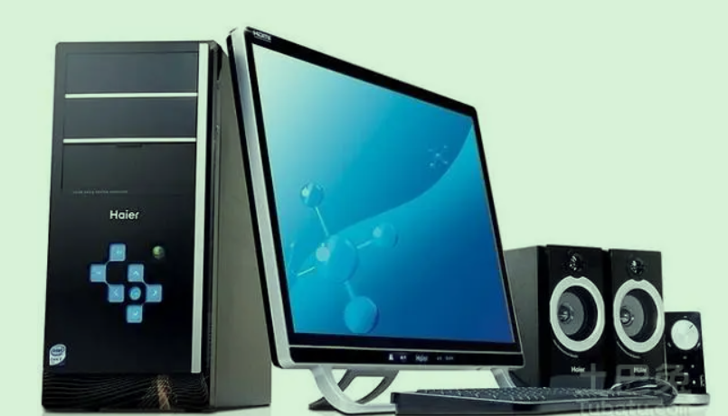

## 电子计算机(电脑) (软件控制型计算机器)

资源
- 电力
- 半导体 (控制导体)
- 导体

## 算法

- 物质的设计方案

### 复杂度

- 设计方案的复杂度

## 计算机的由来

- 机械式 
- 电子管 
- 晶体管
- 集成电路

## 数据表示 

### 门电路

- 开关电路
- 二进制逻辑
- 二进制数据

### 磁系统

### 图像

### 声音

### 程序设计

### 数据压缩

## 操作系统

- 多任务的算法
- 安全

## 组网和因特网

为了互相交流，有什么方法可以互相联通呢 ？ 网络可以呀

网络形式
- 客户端
- 服务器

或 
- 服务客户一体 （通讯软件）

## 安全性
 病毒木马

 ## 软件工程
大型软件

- 分解 模块化
- 耦合 独立
- 测试 质量保障
- 文档
- 界面 UI
- 版权

## 数据库系统
- 回滚
- 锁定

## 图形
- 2D
- 3D
- 照明
- 动画

## 人工智能