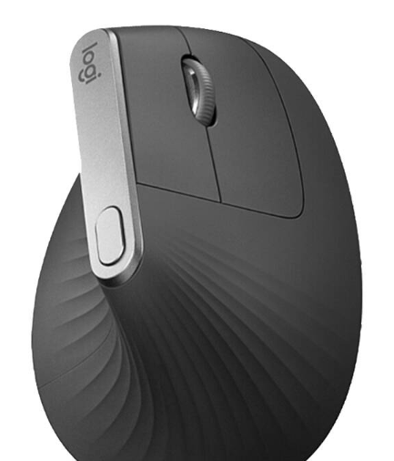

## 事件


### 鼠标事件



| 名称                | 含义 |
|---------------------|------|
| window.onmousewheel | 滚轮 |

### 键盘事件
## 表单重复提交

- 1、js禁掉提交按钮

 表单提交后使用Javascript使提交按钮disable。这种方法防止心急的用户多次点击按钮。
 但有个问题，如果客户端把Javascript给禁止掉，这种方法就无效了。

- 2、使用 Post/Redirect/Get模式。
在提交后执行页面重定向，简言之，当用户提交了表单后，你去执行一个客户端的重定向，转到提交成功信息页面。
 这能避免用户按F5导致的重复提交，而其也不会出现浏览器表单重复提交的警告，也能消除按浏览器前进和后退按导致的同样问题。

- 3、在session中存放一个特殊标志 (token)。

 在服务器端，生成一个唯一的标识符，将它存入session，同时将它写入表单的隐藏字段中，然后将表单页面发给浏览器，用户录入信息后点击提交，在服务器端，获取表单中隐藏字段的值，与session中的唯一标识符比较，相等说明是首次提交，就处理本次请求，然后将session中的唯一标识符移除；不相等说明是重复提交，就不再处理。

 这使你的web应用有了更高级的XSRF保护。

- 4．使用header函数转向

 除了上面的方法之外，还有一个更简单的方法，那就是当用户提交表单，服务器端处理后立即转向其他的页面
```
 if (isset($_POST['action']) && $_POST['action'] == 'submitted') {
 //处理数据，如插入数据后，立即转向到其他页面
 header('location:submits_success.php');
 }
```
 这样，即使用户使用刷新键，也不会导致表单的重复提交，因为已经转向新的页面，而这个页面脚本已经不理会任何提交的数据了。

- 5.表单过期的处理

 在开发过程中，经常会出现表单出错而返回页面的时候填写的信息全部丢失的情况，为了支持页面回跳，可以通过以下两种方法实现。

 1．使用header头设置缓存控制头Cache-control。
``` php
 header('Cache-control: private, must-revalidate'); //支持页面回跳
```
 2．使用session_cache_limiter方法。
``` php
 session_cache_limiter('private, must-revalidate'); //要写在session_start方法之前
```
 下面的代码片断可以防止用户填写表单的时候，单击“提交”按钮返回时，刚刚在表单上填写的内容不会被清除：
``` php
 session_cache_limiter('nocache');
 session_cache_limiter('private');
 session_cache_limiter('public');
 session_start();
```
 //以下是表单内容，这样在用户返回该表单时，已经填写的内容不会被清空

 将该段代码贴到所要应用的脚本顶部即可。

## jquery 防止重复点击提交
**** 方法一： 使用 css 禁用属性 ------ disable
       该方法只能点击一次，若想再次点击需要页面重新进行了加载或者跳转；

#+BEGIN_EXAMPLE
        $(function(){
            $('#submitBtn').on('click‘，function(){
                    $(this).attr('disabled',true); //点击后就禁用，若想再次点击需刷新页面；
                    $(this).val('登录中...');  //此处设置 value 值给以提示
                    this.form.submit();
            });
        });
#+END_EXAMPLE

**** 方法二： 使用 jquery 中 one() 方法

同样是上面 Html 例子，也是只可点击一次；再次点击需要页面重新进行了加载或者跳转；该方式是将绑定 on 方法 改为 one 方法 ，如下：

#+BEGIN_EXAMPLE
     
        $(function(){
            $('#submitBtn').one('click‘，function(){
                    $(this).attr('disabled',true); //点击后就禁用，若想再次点击需刷新页面；
                    $(this).val('登录中...');  //此处设置 value 值给以提示
                    this.form.submit();
            });
        });
#+END_EXAMPLE

**** 方法三： 针对 ajax 请求方式

异步请求更好的适应用户的体验，为防止多次提交，可在提交前做处理；

#+BEGIN_EXAMPLE
     $(function () {
        $('#submitBtn').click(function () {
            //1.先进行表单验证
            //......
            //2.异步提交
            $.ajax({
                url: url+'/login',
                data: $('form').serialize(),
                type: 'post',
                beforeSend: function () {
                    //3.设置提交按钮失效，以实现防止按钮重复点击
                    $(this).attr('disabled', true);
                    //4.给用户提示
                    $(this).val('登录中...');
                },
                complete: function () {
                    //5.提交完成后按钮重新设置有效
                    $(this).removeAttr('disabled');
                },
                success: function(data){
                    if (data === 'ok') {
                        alert('登录成功！');
                        //做逻辑处理
                        //......
                    } else {
                        alert('登录失败，请重新登录！');
                    }
                }
            }); 
        });
    });
#+END_EXAMPLE

