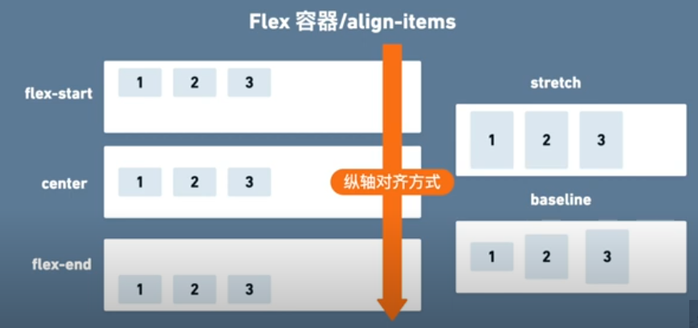
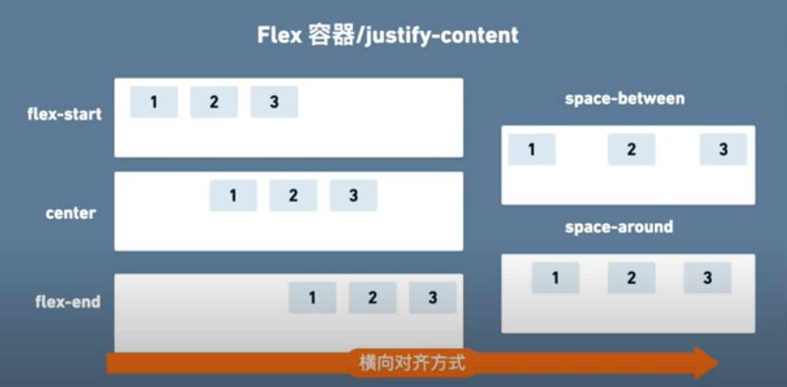

## CSS

- **图文展示**的元素默认有一个浏览器固定样式 (大小，间距），你可以通过 CSS 自定义样式。

### 元素块的显示方式 

> 纵向对齐

> 横向对齐



- 排列方向: flex-direction : row , row-reverse , column ,column-reverse
- 溢出处理: flex-wrap : nowrap(会溢出)， wrap (溢出部分会换行)， wrap-reverse
- 纵向对齐: align-items   
- 横向对齐
-  justify-content (单行)
-  横向对齐 align-content( 多行 )

2. 元素
扩展: flex-grow
收缩: flex-shrink
基础长度: flex-basis

### 定位

- 静态坐标 static  (文档流坐标，默认) 设置了偏移，不影响元素所在位置
- 相对坐标 relative   (相对文档流坐标，设置偏移后，元素会偏移，但其原有的文档流位置保留)
- 绝对坐标 absolute (会脱离文档流，其它元素的位置会变化)
- 固定坐标 fixed (同样会脱离文档流)

## 元素块选择器 
> 增强某样式的权重  !important

### 标签选择器
### 属性选择器 

| 代码                                 | 说明                          |
| ------------------------------------ | ----------------------------- |
| [attribute="value"]                  | attribute值是value            |
| [attribute~="value"]                 | 有一个是value                 |
| [attribute          &#124;= "value"] | 是value或以value-开头的字符串 |
| [attribute^="value"]                 | 最前是value                   |
| [attribute$="value"]                 | 最后是value                   |
| [attribute*="value"]                 | value出现过至少一次           |

### 位置选择器 

| 符号  | 说明                               |
| ----- | ---------------------------------- |
| A > B | 子代选择器，选择A下一层的元素B     |
| A ~ B | 兄弟选择器，选择与A同层的元素B     |
| A + B | 相邻兄弟选择器，选择与A相邻的元素B |
| A B   | 后代选择器，包含选择符             |

### 其他

| 符号               | 说明                                             |
| ------------------ | ------------------------------------------------ |
| :link              | 选择所有未访问链接                               |
| :visited	a:visited | 选择所有访问过的链接                             |
| :active	a:active   | 选择正在活动链接                                 |
| :hover	a:hover     | 把鼠标放在链接上的状态                           |
| :focus	input:focus | 选择元素输入后具有焦点                           |
| :first-letter      | 元素的第一个字母                                 |
| :first-line        | 元素的第一行                                     |
| :first-child       | 选择器匹配属于元素的第一个子元素                 |
| :before            | 在元素之前插入内容                               |
| :after             | 在元素之后插入内容                               |
| :lang(language)    | 为元素的 lang 属性选择一个开始值                 |
| :nth-child         | 第几个，从1开始 :nth-child(an+b)或 :nth-child(n) |
| :not()             | 排除                                             |

 
## 单位

### 颜色
1.  使用颜色的名字表示特定颜色  red , yellow  
2.  rgb(0,100,100) 用十进制的 rgb 混色模式 (255的色值)
3.  \#ffffff 用十六进制的 rgb 混色模式
4.  hsl(0,100%,50%) 用色相(0-360)，饱和度，明度的混色模式表示
5.  设置透明 [图片(opacity:0.8)] [文字rgba(100,0,0,0)]  (0-1) 0是全透明

### 长度
> CSS 中的长度单位是一定要写的，因为有多种 

#### 绝对长度 (尺寸不固定，慎用) 

| 单位 | 描述                             |
| ---- | -------------------------------- |
| cm   | 厘米                             |
| mm   | 毫米                             |
| in   | 英寸(inch) (1in = 96px = 2.54cm) |
| pt   | 点 (1pt = 1/72 of 1in)           |
| pc   | 派卡 (1pc = 12 pt)               |

像素（px）是相对于观看设备的。对于低 dpi 的设备，1px 是显示器的一个设备像素（点）。对于打印机和高分辨率屏幕，1px 表示多个设备像素。

1 `in`=2.54`cm`=25.4`mm`=72`pt`=6`pc`=96`px`。

#### 相对长度 (随着浏览器窗口缩放进行缩放)

| 单位 | 描述                                                                          |
| ---- | ----------------------------------------------------------------------------- |
| px   | 像素 (1px = 1/96th of 1in)                                                    |
| em   | 相对于元素的字体大小（font-size，默认为 16px）（2em 表示当前字体大小的 2 倍） |
| ex   | 相对于当前字体的 x-height(极少使用)                                           |
| ch   | 相对于 "0"（零）的宽度                                                        |
| rem  | 相对于根元素的字体大小（font-size）                                           |
| vw   | 相对于视口*宽度的 1%                                                          |
| vh   | 相对于视口*高度的 1%                                                          |
| vmin | 相对于视口*较小尺寸的 1％                                                     |
| vmax | 相对于视口*较大尺寸的 1％                                                     |
| %    | 相对于父元素                                                                  |

像素是相对长度，因为按照分辨率来的，对于100m长度，分辨率是10的化，单位像素就是10
提示：em 和 rem 单元可用于创建完美的可扩展布局！
* 视口（Viewport）= 浏览器窗口的尺寸。如果视口宽 50 里面，则 1vw = 0.5cm。

## 样式 
### 浏览器特殊前缀 
- -o- Opera 
- -webkit- safari 和 chrome
- -moz- mozilla

### 背景色


background-color
### 背景图像 
background-image:url('')
### 文本样式

- 内容排列  text-align 不光是文字排列 (left,right,center,word-spacing ,letter-spacing)
- line-height 行高
- 文本装饰  text-decoration  underline(下划线) overline(上划线) line-through(穿过线) blink(闪烁)	 inherit
- 字体  font-family  字型 font-family: Times, Times New Roman, Georgia, serif;
- 字体大小 font-size
- 颜色  color (rgb、rgba，hsla)  hsl(127,80%,80%)
- 透明度 opacity: 0.6;
- 字符转换  text-transform (uppercase , lowercase, capitalize)
- 粗细、样式、拉伸和装饰(font-weight / font-style / font-stretch / text-decoration)
- 行间距(line-height)、字母间距(letter-spacing)和单词间距(word-spacing)
- 对齐 (text-align)方式
- 缩进 (text-indent)
- 链接样式（:link / :visited / :active / :hover）
- 阴影效果 - text-shadow: 水平偏移 垂直偏移 [模糊半径][颜色]
- 首字母和首行文本(:first-letter / :first-line)
- 响应用户
- 换行模式  white-space (nowrap 不换行, normal 换行)
- word-break: break-all
box-shadow: 10px 10px 5px #888888;
box-shadow: h-shadow v-shadow blur spread color inset;

| 值       | 描述                                     |
| -------- | ---------------------------------------- |
| h-shadow | 必需。水平阴影的位置。允许负值。         |
| v-shadow | 必需。垂直阴影的位置。允许负值。         |
| blur     | 可选。模糊距离。                         |
| spread   | 可选。阴影的尺寸。                       |
| color    | 可选。阴影的颜色。请参阅 CSS 颜色值。    |
| inset    | 可选。将外部阴影 (outset) 改为内部阴影。 |

       

### 背景

#### 渐变背景
background-image: linear-gradient(direction, color-stop1, color-stop2, ...);

``` css
/* 从上到下，蓝色渐变到红色 */
linear-gradient(blue, red);
/* 渐变轴为45度，从蓝色渐变到红色 */
linear-gradient(45deg, blue, red);
/* 从右下到左上、从蓝色渐变到红色 */
linear-gradient(to left top, blue, red);
/* 从下到上，从蓝色开始渐变、到高度40%位置是绿色渐变开始、最后以红色结束 */
linear-gradient(0deg, blue, green 40%, red);

```

``` css
body{
  width: 100%;
  height: 100vh;
  background: #63c0e1;
  background: linear-gradient(-150deg, #4ad8c3, #83a2f1);
  display: flex;
  justify-content: center;
  align-items:center;
}

```

#### 多背景 

background: url() left top no-repeat ,url() right bottom no-repeat;

#### 遮罩
mask-box-image:url() 75 stretch;
mask-image: linear-gradient(left, rgba(209, 36, 36, 0), rgba(33, 30, 30, 0) 30%);

### 定义边框

-   盒子大小（width / height）
-   盒子的边框、外边距和内边距（border /  margin / padding）
-   盒子的显示和隐藏（display / visibility）
-   CSS3 新属性
    -  边框图像（border-image）
       * border-image-source  //背景图片源
       * border-image-slice  //图片边框内偏移
       * border-image-width  //图片边框的宽度
       * border-image-outset  //边框图像区域超出边框的量
       * border-image-repeat  //边框是否适应平铺(repeated)、铺满(rounded)、拉伸(stretched)

    -   投影（border-shadow）
    -   圆角（border-radius）
        - border-top-left-radius:10px;
        - border-top-right-radius:10px;
        - border-bottom-right-radius:10px;
        - border-bottom-left-radius:10px;

盒倒影 box-reflect

box-reflect：none , direction offset, mask-box-image
- direction (above | below | left | right)
- offset  (length | percentage)
- mask-box-image (none | url | linear-gradient | radial-gradient | repeating-linear-gradient | repeating-radial-gradient)

-webkit-box-reflect:below 0 -webkit-linear-gradient(transparent,transparent 50%,rgba(255,255,255,.3));

### 链接

- a:link  普通的、未被访问的链接
- a:visited  用户已访问的链接
- a:hover -鼠标指针位于链接的上方
- a:active  链接被点击的时刻

### 列表
- 列表的项目符号 list-style
- 表格的边框和背景 border-collapse
- 列表橫向顯示  display:none  

### 图像

- 控制图像的大小（display: inline-block）
- 对齐图像
- 背景图像（background / background-image / background-repeat / background-position）

### 定位 position 

    - 普通流  默认
    - 相对定位 relative  相对于原来所在的位置进行定位，元素占有空间
    - 绝对定位 absolute 相对于原来所在的位置进行定位, 元素没有空间
    - 固定定位 fixed
    - 浮动元素（float / clear）  左右浮动

定位方式
- top  距窗口顶部距离
- right
- bottom
- left
- overflow 溢出
- vertical-align 垂直对齐
- z-index 堆叠顺序


解决子div设float后导致父div无法自动撑开(常用2种)

原因：内部的DIV因为float:left之后，就丢失了clear:both和display:block的样式，所以外部的DIV不会被撑开。
- 1)直接给父div设置 "display: inline-block;"
- 2)在最后添加一个 div 用来清除浮动 
- ```<div style="clear:both;"></div> ```

### 弹性布局 flexbox

任何一个容器都可以指定为 Flex 布局
``` css
.box{
  display: flex;
}
```

行内元素也可以使用 Flex 布局。

``` css
.box{
  display: inline-flex;
}
```

Webkit 内核的浏览器，必须加上 =-webkit=前缀。
     
``` css
.box{
  display: -webkit-flex; /* Safari */
  display: flex;
}

```

#### 容器的属性

以下6个属性设置在容器上。

- flex-direction 排列方向 row (默认)| row-reverse | column | column-reverse;
- flex-wrap 截断方式 nowrap | wrap 第一行在上方| wrap-reverse 第一行在下方
- flex-flow  flex-direction和 flex-wrap的简写形式
- justify-content 对齐方式 flex-start | flex-end | center | space-between | space-around
- align-items       逆向轴对齐方式   flex-start | flex-end | center | baseline | stretch;
- align-content 定义了多根轴线的对齐方式。如果项目只有一根轴线，该属性不起作用。
- align-content: flex-start | flex-end | center | space-between | space-around | stretch;

#### 项目属性

- order  定义项目的排列顺序。数值越小，排列越靠前，默认为0
- flex-grow  放大比例 如果存在剩余空间，也不放大
- flex-shrink 缩小比例，默认为1，即如果空间不足，该项目将缩小
- flex-basis
- flex  flex是 flex-grow, flex-shrink 和 flex-basis的简写，默认值为 (0 1 auto)
- align-self  允许单个项目有与其他项目不一样的对齐方式，可覆盖 align-items 
- align-self: auto | flex-start | flex-end | center | baseline | stretch

``` css
/* 设置 Flex 模式 */
display: flex;
/* 决定元素是横排还是竖着排，要不要倒序 */
flex-direction: column;
/* 决定元素换行格式，一行排不下的时候如何排 */
flex-wrap: wrap;
/* flex-flow = flex-direction + flex-wrap */
flex-flow: column wrap;
/* 同一排下对齐方式，空格如何隔开各个元素 */
justify-content: space-between;
/* 同一排下元素如何对齐，顶部对齐、中部对齐还是其他 */
align-items: center;
/* 多行对齐方式 */
align-content: space-between;
```
### 定义要引入的网络字体 (注意版权)
``` css
@font-face{
font-family:Calibri;
src:url(http://www.examples.com/fonts/Calibri.ttf);
}
```
### 媒体查询 (根据不同设备适配不同样式)

``` css
 .my-class {
   width: 40px;
 }

 @media (min-width: 480px) {
   /* 仅在 480px 或更宽的屏幕上生效的样式规则 */
   .my-class {
     width: 200px;
   }
 }
 
```

``` css
    @media all and (min-width: 800px) and (max-width: 1024px) {
      ...;
    }

```

## 高级功能
### viewport (视窗)
1.  禁用缩放(手机默认会启用缩放)
``` html
<meta name="viewport" content="width=device-width, initial-scale=1" />
<meta name="viewport" content="initial-scale=1.0,minimum-scale=1.0,maximum-scale=1.0,user-scalable=no" />
```

2.  设备无关像素(dip device-independent pixel )

    width=device-width 可指示网页与屏幕宽度（以设备无关像素为单位）进行匹配。这样，网页就可以重排内容以匹配不同的屏幕尺寸。


### 定义变换 transform 

-   transform:
    -   translate(X,Y) 平移多少位置
    -   rotate() 旋转多少角度 ( 30deg )  多少圈 (0.5turn 半圈)
    -   scale(2,4) 缩放
    -   skew(30deg,20deg) 倾斜
    -   matrix() 需要六个参数，包含数学函数，旋转、缩放、移动以及倾斜
    -   transform-origin 	允许你改变被转换元素的位置


### 过渡效果 动画

div{transition:width 2s;}
div:hover{width:300px;}

-   transition-property 	规定应用过渡的 CSS 属性的名称
-   transition-duration 	定义过渡效果花费的时间
-   transition-timing-function 	规定过渡效果的时间曲线
-   transition-delay 	规定过渡效果何时开始


### 移动优先

当用手机打开网页的时候，默认打开的只是相对比较简单的手机版样式，而复杂一些的桌面版的相应样式都在 media-query 中包裹着，所以不会加载，那么这样页面访问速度是最佳的。 参考下面代码

    .content {
      /* 一些简单的样式，专门为手机而生 */
    }
    
    @media screen and (min-width: 400px) {
      .content {
        /* 为大屏设备设计的比较复杂的样式 */
      }
    }


### 滚动条
用 max-width 代替 width 可以防止窗口太小时出现滚动条

## 溢出用省略号

``` css
/*1.强制在同一行内显示所有文本，直到文本结束或者遭遇br标签对象才换行*/
white-space: nowrap;
/* 2. 超出的部分 隐藏*/
overflow: hidden; 
/* 3. 溢出的部分用省略号替代*/
text-overflow: ellipsis; 
/* 以上3个步骤一个都不能少*/
``` 

### CSS中添加 文本内容 content
``` css
q {
    color: #00008B;
    font-style: italic;
}

q::before   { content: open-quote }
q::after    { content: close-quote }

h1::before  { content: "Chapter "; }
```

## 灰度
filter: blur(px);模糊度
filter: grayscale(%);灰度
filter: hue-rotate(deg);色相转换
filter: drop-shadow(px px px green);阴影


## select option 设置样式

``` html
<!-- select外面必须包裹一个div,用来覆盖select原有的样式 -->
<div class="option">
        <select name="">
          <option value=" ">筛选实验类型</option>
          <option value="实验1">实验1</option>
          <option value="实验2">实验2</option>
        </select>
      </div>
```
``` css
.option{
/*用div的样式代替select的样式*/
    margin: 100px;
   width: 140px;
    height: 40px;
    /*border-radius: 5px;*/
  /*盒子阴影修饰作用,自己随意*/
 /* box-shadow: 0 0 5px #ccc;*/
    border: 1px solid #cccccc;
    position: relative;
}

  .option select{
  /*清除select的边框样式*/
  border: none;
  /*清除select聚焦时候的边框颜色*/
  outline: none;
  /*将select的宽高等于div的宽高*/
  width: 100%;
    height: 40px;
    line-height: 40px;
  /*隐藏select的下拉图标*/
  appearance: none;
    -webkit-appearance: none;
    -moz-appearance: none;
  /*通过padding-left的值让文字居中*/
  padding-left: 20px;
  }

/*使用伪类给select添加自己想用的图标*/
  .option:after{
      content: "";
      width: 14px;
      height: 8px;
      background: url(../assets/arrow-down.png) no-repeat center;
    /*通过定位将图标放在合适的位置*/
    position: absolute;
      right: 20px;
      top: 41%;
    /*给自定义的图标实现点击下来功能*/
    pointer-events: none;
    }
```