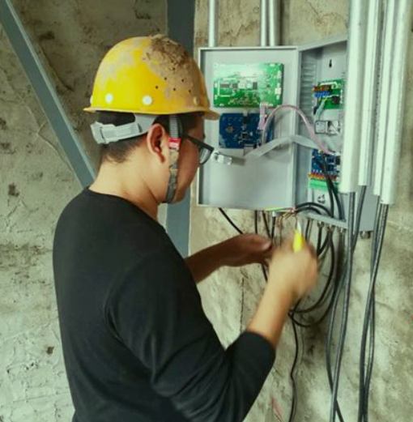

## venv
虚拟


## 安装




```sh
sudo apt install python3-venv
```

## 创建虚拟环境

```sh
python3 -m venv test_env
```

## 启用虚拟环境


```sh
.\test_env\bin\activate.bat
```

使用pip安装需要的包：
```sh
pip install tensorflow
```

## 退出虚拟环境
```sh
deactivate
```