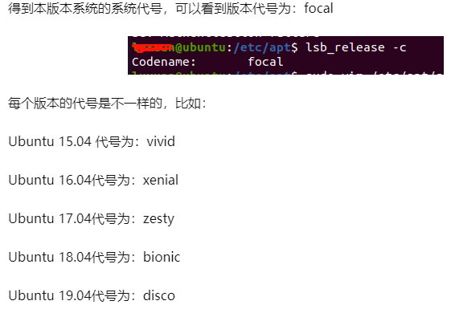

## apt 

### Ubuntu 20.04 更改 阿里源

1. 备份

```sh
sudo cp /etc/apt/sources.list /etc/apt/sources.list.bak
```

2. 查看版本号
```sh
lsb_release -c
```



3. 编辑 sources.list 文件


```
1. deb http://site.example.com/debian distribution component1 component2 component3
2. deb-src http://site.example.com/debian distribution component1 component2 component3
```

```
deb http://mirrors.aliyun.com/ubuntu/ focal main restricted universe multiverse
deb-src http://mirrors.aliyun.com/ubuntu/ focal main restricted universe multiverse
deb http://mirrors.aliyun.com/ubuntu/ focal-security main restricted universe multiverse
deb-src http://mirrors.aliyun.com/ubuntu/ focal-security main restricted universe multiverse
deb http://mirrors.aliyun.com/ubuntu/ focal-updates main restricted universe multiverse
deb-src http://mirrors.aliyun.com/ubuntu/ focal-updates main restricted universe multiverse
deb http://mirrors.aliyun.com/ubuntu/ focal-backports main restricted universe multiverse
deb-src http://mirrors.aliyun.com/ubuntu/ focal-backports main restricted universe multiverse
deb http://mirrors.aliyun.com/ubuntu/ focal-proposed main restricted universe multiverse
deb-src http://mirrors.aliyun.com/ubuntu/ focal-proposed main restricted universe multiverse
```

4. 更新软件列表

```sh
sudo apt update
```

5. 更新软件包
```sh
sudo apt upgrade
```