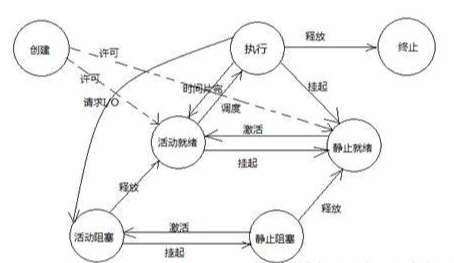

## linux

特点
- 提供漂亮的 图形界面 或 命令行 界面
- 源码开放，可自定义
- 基本工具 (木工)

### 进入系统 (引导程序管理员)

- 有个 漂亮的 界面 或 命令行
- 有图标 点击 就能 启动  软件

### 进程树 (管理员)


进程状态切换规则


- 可切换不同的软件

### 目录树 (管理员)


- 按照层级存放资料

```sh
ls -l  # 显示文件
chgrp [-R] 属组名 文件名  # 更改文件归属
```

### 磁盘管理 (管理员)

- 存放资料的盘

``` sh
df [-ahikHTm] [目录或文件名]  #查看磁盘
du [-ahskm] 文件或目录名称  # 查看磁盘用量
mkfs [-t 文件系统格式] 装置文件名 #磁盘格式化

#磁盘挂载与卸除
mount [-t 文件系统] [-L Label名] [-o 额外选项] [-n]  装置文件名  挂载点
```

### 网络管理

- 以太网
- 无线网

### 网络软件

- www html服务
- 网络文件传输服务
- 网络聊天服务


### 软件包管理

- 方便的软件安装工具

```sh
列出所有可更新的软件清单命令：sudo apt update
列出所有已安装的包：apt list --installed
查找软件包命令： sudo apt search <keyword>
移除软件包及配置文件: sudo apt purge <package_name>
```

### 多账号登录

