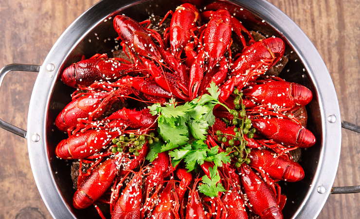
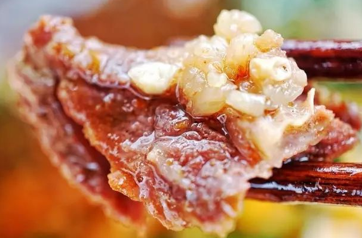
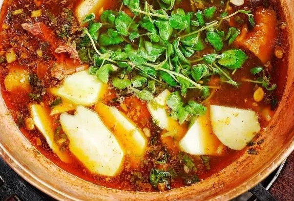
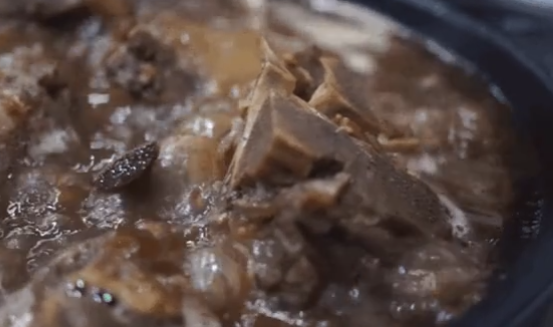
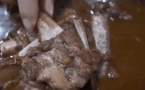
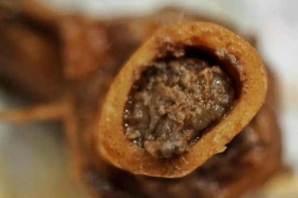

1
今天我们来洛社吃龙虾家常菜啦
我们家最有特色的就是这个龙虾牛蛙

3斤中虾加两只大牛蛙

还有两个配菜
原价要200多的
现在抖音团购到99
这个蒜香味纸包鱼也是我们家的特色
真的特别好吃
而且这里还可以一边唱歌一边吃饭
欢迎大家来品尝

2

南门800万的青皮烧
又出188的双人套餐了
菜品丰富
足足9道菜上了满满的一大桌
环境也是传统的日系风格
在这里约会
和朋友小聚都是不错的选择
套餐性价比很好
赶紧左下角团了来吃吧

3

我靠你敢信
满满一大盘35串烧烤只要9块9
就约会老板娘搞事情啦
活动真实有效
左下角快来薅羊毛

在江阴城东的港立大酒店
这满满一桌7-8人摊仅需558
有元宝鸡为虾
清蒸鲜黄鱼
蒜蓉粉丝扇贝
毛血旺雪龙黑牛拼毛肚全是硬菜
包间也很大气
聚餐和请客可以看过来

申港街上的牛小官新店开业啦
一个锅底加上6个配菜加一份面条
视频左下角下单仅需99
牛肉牛杂都是现切的哦

申港红豆万花城一楼法帝诺也出抖音团购啦
4寸动物奶油蛋糕
视频左下角下单仅需29.9哦
两种口味可选
快给我们平淡的日常里加一点甜吧

今天我们再次来长寿的辣煌逅吃烧鸡公
他们家的鸡是活杀现烧的
表皮黄而不黑
咬上一口，有肉的嚼劲加调料的香味
肥美而多汁
牛蛙炸的外皮酥脆
蛙肉保持着原有的清香
另外告诉你们一个小秘密
他们家厕所居然也有空调哦

现在抖音团购到99
这个蒜香味纸包鱼也是我们家的特色
真的特别好吃
而且这里还可以一边唱歌一边吃饭
欢迎大家来品尝

今天我们来祝塘吃阿田大虾
他们家的特色的就是深海大虾
虾肉饱满
吃到嘴里满口的鲜香
令人回味
加上这4个配菜
视频下单只要99
可以两个人一起吃哦
欢迎大家来品尝

你试过在樱花树下吃鸡吗
今天来文定路吃光头鸡
一只整鸡外加5道小配菜
抖音团购只要78
鸡都是苏北散养黑爪鸡
带上秘制酱料鲜嫩爽滑
吃完再烫一下小配菜
装修是为美的樱花树
关键还是24小时不打烊
想吃夜宵的点击地址

懂事的女人都会带老公来这家店
王八炖鸡加上牛鞭和6只鲍鱼和黄鳝
就这一锅滋补男神套餐还有配菜
抖音团购只要138
七旬老汉吃了也能挺直腰板
让千万落魄男人找回自己
让你不受爱情的苦
保你开心快充

我媳妇就是吃了我煮的肥肠
就再嫁给我的
大家好我是夏港重庆烧鸡公老板
下岗重庆烧鸡公第3店开业之际
我们联合抖音推出团购活动
一份肥肠鸡一份美蛙鱼头二选一
加6个配菜原价268
抖音下单只要168
一份烤鱼加6个配菜原价228
抖音下单只要128另外啤酒免费畅饮
多喝啤酒送一瓶雪碧或者可乐
我们营业时间是上午9点到晚上9点
下岗重庆沙棘宫第三店与你不见不散

我开人民公社的初衷
就是想做我们家乡菜
让更多人喜欢我们的湖南菜
我们人民公社在江阴
开了一12个年头了
我们一直就是做到好吃不贵最实惠
做到这个大家的家庭缺乏
我们也是置于这个食材之上
一直是选用这个最本土的食材
我们这个食材啊一直也不断的在找
就是从源头找这个
我们很多食材啊
是从这个湖南空运过来的
一般都是当天采购
第二天就到我们这个店里面了
呃我们这个充分的保证它的新鲜
我们希望就是让每个顾客
吃到最实惠的
最好的东西

烧鸡公是非常接地气
非常受欢迎的一道美食
我们都是重庆本地人
专注烧鸡公这道菜20多年
食材都是每天新鲜配送
独家配方
做的是正宗重庆烧鸡公
然后结合了无锡本地人的口味
进行改良
在辣度和口味的选择上有很多
鸡肉紧实不柴
非常入味下饭
韩国香辣虾也很受欢迎
香辣开胃
分量也很足
一锅两吃
吃完还能涮火锅
而且价格也很实惠
人均的话大概340
营业时间至凌晨5点
口味好食材新鲜
价格实惠
我们的宗旨是笑迎八方客客笑意满盈

烧鸡公是重庆的一道经典江湖菜
用公鸡、青辣椒、芹菜、洋葱等食材制作
口味以麻辣为主
我们都是重庆本地人
专注烧鸡公这道菜20多年
食材都是每天新鲜配送
现在我们在抖音做活动
一份烧鸡公或骨头煲二选一
加上6个配菜
原价200多，抖音下单138元
可以4人就餐
还有特价菜香辣虾
一份只需78
我们希望就是让每个顾客
吃的实惠
吃的开心

想要头发好，还是得护理头皮！关键整个过程太舒适了！#团购达人 #美在无锡 #无锡探店 #强烈推荐 #浪计划探店篇 #养发

哇，昨天刚洗的头发，今天又油了
人过30，油脂分泌好旺盛
蒙霸养发中心，用的是草本精油
能改善头皮毛孔堵塞问题
这个是头皮检测，养护师会根据发质进行对症服务
如果头皮屑多，可以使用幽谷草头皮深层清洁
用来改善头皮毛孔堵塞
现在抖音下单是39.9元
对于头发稀疏的问题，这边使用特殊精油进行头皮按摩
促进头皮吸收来防脱生发
现在下单只需98
更多服务可以点击左下角地址查看的哦

地锅鸡源于苏北和皖北的交界处
是安徽的招牌菜之一
传统的土灶铁锅搭配上当地黑脚走地鸡擦出的火花
称之为“地锅鸡”
地锅鸡之所以能成为特色招牌菜
缘于其美味不单单表现在香嫩入味的鸡块
锅上的薄饼更是锦上添花。

煮好后的地锅鸡
汤少味浓，口味鲜醇
饼借菜味，菜借饼香
具有软滑与干香并存的特点
浓厚的酱汁裹满每块鸡肉
咬一口弹、鲜、浓、香

@所有人 
商户名称：渝府大院（杭州临安区） 
套餐1:重庆老火锅138元2-4人餐  
 锅底+9个配菜（4荤5素）
 +小吃（2选1）+酸梅汁
套餐2:6-8人餐228元
锅底+12个配菜（6荤6素）
+小吃（2选1）+酸梅汁
发布时间：明天9月6日下午3点统一发布

一个锅底+9个配菜+小吃+酸梅汁
视频下单只需138元
搭配自己配置的调料
嗯，真好吃

商家名称：大串东北烧烤塘市店 
套餐1:
4-6人羊腿套餐
二选
1碳烤羊腿-238
2碳烤羊排-238
融合菜6个
原价502折后299
套餐2:
4-10人餐
碳烤全羊一只1380
融合菜6个
原价1644折后789

商户名称：左庭右院八佰伴店
套餐:
秋意双人餐 
牛汤锅底 
吊龙一份 鲜牛肉一份 牛霖一份 牛牛餐肉一份 
三份蔬菜 一份主食 一瓶酸梅汁
抖音价252

火遍江浙沪的左庭右院鲜牛肉火锅也来江阴啦
牛汤作为锅底
吊龙，鲜牛肉，牛霖 ，牛牛餐肉
用来涮肉
加上三份蔬菜 ，一份主食
和你的Ta来体验深秋的火锅吧
嗯，这牛肉真鲜

璜塘川福火锅店 
烧鸡公3-4人餐
抖音下单139
锅底三选一
有烧鸡公，鱿鱼虾，酸菜鱼
外加十个配菜
送四瓶啤酒+酸梅汁
乘着周末，赶快来吃吧

今天终于吃到心心念念的烧鸡公了
就在这家辛庄川福楼火锅
鸡是5斤多的，活杀现烧
肉质鲜美，吃了还想吃
他们家还有干锅虾
QQ谈谈
真的很好吃
喜欢的朋友可以视频左下角下单哦

肥肠炖黑鱼吃过没
还是麻辣味的哦
鱼肉嫩嫩的
看的我眼泪从嘴角流出来了
这么一桌
加炒菜加小酥肉
还有小菜啤酒
只要139.9哦
快点来吃吧

今晚夜色很美，适合微醺哦
当生活给你柠檬，管它要盐和龙舌兰
放轻松，给一个微醺的微笑
尽情跟着音乐跳舞吧
陈酒味醇，老友情深
想要一点微醺
我喜欢醉醺醺，清醒我就不浪漫了
今晚是属于女孩自己的微醺夜晚
不要错过美酒，以及诱人的秋天
今朝有酒今朝醉，生活不要太疲惫
太阳落山就是喝酒的信号
梦想还是要有的，不然喝醉了吹啥
眼前酒，当下人
海滩，烧烤，冰啤酒，和围着篝火唱歌的老友能治愈一切
人生最好的状态恰如微醺

你敢信吗
陈娟重庆老火锅
满满一大桌10个涮菜 
加上饮料
抖音下单139
活动真实有效
左下角快来薅羊毛
还有单品
烧鸡公或烤鱼
只需78哦
两个人吃的饱饱

地锅鸡不仅香气浓、样好看
味道也很特别
它不像辣子鸡 一辣到底
也不像糖醋里脊，酸酸甜甜
它初入口中时，味道烈，有点咸
但一咬鸡肉
就会发现它咸辣中带着丝丝甜味
就像花朵闻到了花蕊
有意想不到的惊喜
通常,我吃地锅鸡时
喜欢用筷子把鸡肉一块一块剥下来
把饼子全部在菜汤里泡一泡
再用全身都是汤汁的面饼卷上嫩嫩的鸡肉
把鸡肉和饼子一起入口
那可真是人间美味啊

桃酥来啦
江阴新华书店对面的
彭记口口香
金典桃酥
一共8片
视频下单只需要4.9哦
记得小时候吃的桃酥
都是妈妈帮做好事获得的
有桃酥，麻花，瓜子，花生糖果等等
啊，童年，人生

鸣凰凤林北路川府烧鸡公
又出抖音套餐了
有烧鸡公，香辣虾，烤鱼
还有鸳鸯火锅
菜品丰富，选择多多
口味适
套餐性价比很好
赶紧左下角团了来吃吧

在文林的地锅江湖
去吃了一次地锅鸡
恋恋不忘那个味道
汤汁很浓
分量也很足

今天我们来礼河渝厨记吃火锅啦
我们家最有特色的就是这个重庆老火锅
有内蒙羔羊肉，谷饲肥牛，鲜鸭肠 
食材真的很新鲜
每次吃火锅必点的哦
原价近300
现在抖音团购179
餐具都是消毒过的
这个万州烤鱼也是我们家的特色
真的特别好吃
欢迎大家来品尝

最好吃的是这种大块牛肉，带点肥肉，浓郁的油脂香气。

最后用这一整锅浓郁的牛肉汤，下两盘新鲜的野菜，唔，爽脆。

在市场买整只牛，牛骨炖汤，牛肉厚切，一起放入铜锅中炖煮沸腾，就是云南的铜瓢牛肉火锅，越炖越香。

冬天刮着冷风的北京，吃羊蝎子最幸福，一上桌香气直往人脸上扑：

羊排上的骨头，轻轻一抽就能掉：

羊拐筋的骨头里，满的骨髓，凑上去吸吸吸：

来红贤庄
我只吃他们家3个菜
中午吃他们家的烧鸡公
鲜、香、麻、辣
晚饭吃他们家猪肚鸡
热汤浓厚鲜美，肚片脆脆嫩嫩的
夜宵吃他们家骨汤鸳鸯火锅
口味麻辣，冬天吃真的很暖和
左下角团起来吧

有一年聚会
大家一起吃火锅
我们拿了一些啤酒
有个同学突然问
有没有人喝白的？我们都摇摇头
他说：“你们都不喝白的啊！
那我喝吧！”
大家都安静的投去了伟岸的眼光
此时这货对老板说
来一瓶营养快线
快线...线...好白啊！

今天我们对味柁主老火锅的几个菜品进行一些说明
首先讲一下烧鸡公
烧鸡公呢
用料复杂，有荤有素
鸡肉吃起来劲道，鲜美，好吃
然后是万州烤鱼
鱼肉色香味俱全
香辣过瘾，越吃越香
配料好吃也很入味
美蛙鱼头呢也是小有名气的
鱼头的美味和美蛙的鲜味融合在一起
蛙肉鲜嫩，鱼头爽口
总的来说，各有各的口味，都很好吃

赞美重庆火锅的古诗

　　（第一首）

　　错落山城夜举觞，齐齐名店火锅香。

　　侍儿添盏诗仙酒，幺妹擎盘麻辣汤。

　　一腹嘉陵江滚滚，千枝斑竹泪行行。

　　欲将块垒都浇尽，浓雾轻魂醉梦长。

　　（第二首）

　　辣子红油炖排骨，清汤辅料闷山珍。

　　素食最忆宽竹笋，荤菜犹馋老肉筋。

　　迎面辛香方入口，绕舌百味欲侵心。

　　谁斟冰水穿肠过？耳畔忽闻仙乐音。

　　（第三首）

　　闻卿气势迫云天，辗转无眠入梦间。

　　呼唤侍儿如狗急，安抚稚子胜熬年。

　　忽闻美味俄倾到，破涕微笑即释然。

　　一碗麻辣穿余腹，肠翻胃倒似晕船。

　　（第四首）

　　秦妈苏姐刘一手，毛肚鳝鱼脆鹅肠，

　　坎下联灯明彻夜，沿街老灶辣飘香，

　　红油锅里集天地，杯酒唇边慰短长，

　　宜把辛劳抛作雨，一山豪气煮炎凉。

用简单食材， 做美味佳肴。
吃起来无骨无渣，清香味十足，口感非常好

这还挺够味

霸王别姬
是徐州的一道传统名菜
汤汁清澄，味鲜醇厚
鸡、鳖肉质鲜嫩酥烂，营养丰富
为宴席肴馔中之上品
现在红焱烧鸡公出团购
只要158
欢迎大家来品尝

人生心累多于身累
心累重于身累
心累困于身累
身累的时候你可以休息休养疏筋按摩
很快就能恢复过来
而心累则无方可施
无药可治

在身心疲惫的时候
能享受一下按摩是一件多么幸福的事情啊
按摩后的身体已经没有了往日的疲惫
精神抖擞的
有空的时候来康伊堂享受一下吧
只要 49.9 

金三峡火锅世纪城店
实惠给到大家
干锅虾双人餐 68元
烧鸡公+8个配菜  98元
老板开店真的很用心了
欢迎大家来品尝

夏港的江南路
晚上是繁华和忙碌的
这边的渝城烤鱼
3斤半左右的炭烤草鱼
加上配菜和饮料，只需98
看上去很有食欲的牛蛙
吃起来新嫩爽口
价格也很实惠
喜欢的宝子不要错过这家店哦

忙碌了一天
在哪里可以放松下呢
可以来峭岐的春秋堂足道
这里60分钟足道+洗浴 99
好吃还好玩

颐和汤泉
套餐一：传统足道109.9
70分钟包含洗浴小吃
套餐二：单人浴资19

天这么冷
还是来澡堂泡澡舒服
不像家里，冷飕飕的
还有精美的小吃，饮料
都不用自己带了
还可以享受下足疗
关键是价格也很优惠
真是休闲的好地方

老鹅煲是一道传统菜肴
在申港申裕街的凤阳一品鲜老鹅汤
老鹅煲3-4人餐，加上鲍鱼和配菜只需 138
顾客可以在这里品尝到正宗的老鹅煲
并且可以与朋友或家人一起享用
餐厅的氛围舒适，服务周到
是一个适合与朋友或家人共进晚餐的好地方
申港凤阳一品鲜老鹅汤是一家值得推荐的餐厅

108元 足浴70分钟+洗浴+小吃
70分钟里包含肩 背 腰 腿 一整套下来 可舒服了
发布时间：12月20日明天上午十点发布

在忙碌的工作之余，来一场足浴按摩是身心放松的最佳选择。足浴按摩不仅能帮助减轻身体疲劳，还能促进血液循环，改善睡眠质量。最近，我去了一家名叫“XX足浴按摩”的店，给大家分享一下我的体验。

在忙碌的工作之余
来一场足浴按摩是身心放松的最佳选择
足浴按摩不仅能帮助减轻身体疲劳
还能促进血液循环
改善睡眠质量
新桥海澜对面的这家
知足常乐馆
店内环境恬淡安静
技师手法熟练
一场按摩下来整个人都放松好多
下次还会光顾

下午3点，一起喝咖啡吧
库迪咖啡宝龙店新店开业
美式咖啡 9.9
生椰拿铁 11.9
让我们的日子温暖有光
咖啡醇厚有香

商户名称：夏港鱼王府火锅
套餐1:烤鱼3斤左右 江团鱼88元 2人餐
套餐2:美蛙遇上鸡 138元 3-4人餐
套餐3:美蛙火锅 138元 3-4人餐
所有套餐 自助台素菜畅吃

咸鱼总是要翻身的
这样烤才能熟透
即便是一条咸鱼
只要敢于上生活这个烧烤架
那也终将成为一道美味
鱼王府的鱼是活的新鲜的
鱼肉嫩滑，鱼皮焦香
沾上酱汁
酸的，甜的，咸的，辣的
充满你的味蕾
满足我们七荤八素的口腹之欲
并且自助台素菜是畅吃的哦

民间传闻
吃猪不如吃牛
吃牛不如吃羊
羊蝎子火锅
这一锅下肚
暖胃暖心又滋补
让你单身都感觉不到冷
配菜食材经过骨汤的浸泡变得有滋有味 
吃起来贼香

无论何时何地，火锅都是最能凝聚情感的美味
也因此催生了各种各样的火锅形式
从北到南，各不相同

探店文案
您好，这里是XX餐厅，我们提供最正宗的火锅体验，给您带来最正宗的四川火锅。
我们的火锅是由有着丰富经验的厨师精心烹制而成，使用最新鲜的当季食材，完美搭配火锅底料，保证每一口都是最新鲜的美味！
我们的火锅口味多样，火锅底料有豆瓣、红油、麻辣等多种口味可供您选择，每一种火锅底料都有独特的香味，让您体验到最正宗的四川火锅！
此外，我们还提供各种蔬菜、肉类、海鲜等火锅料理，让您尽情享受丰富的火锅体验。
心动不如行动，赶快来XX餐厅，领略最正宗的四川火锅吧！

无锡椿一火锅
套餐1:双人餐 89五荤四素