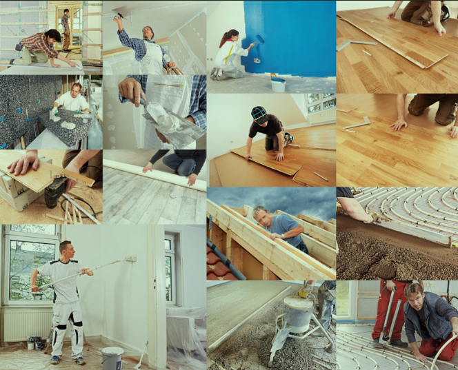

## [Doing] 目标

- [工作] 闲时 发视频 社交
- [学习] 学习技术栈

# TODO Need To do

## TODO 做一个抖音静态页面

## TODO 在 vscode 中处理  TODO List 

安装插件 TODO TREE 即可

## FIXME 完成

## TODO 学习 layui 的使用

[2023/1/5]

<!-- ## 双屏摆放问题 -->

<!-- 弄一个屏幕，不用两个屏幕，伤眼分心 -->

<!-- ## 挣钱装修房子 -->
<!--  -->

<!-- ## 处理 hugo 图片 与  vscode  不一致的问题 -->
<!-- 11.16  (设置本地变量即可) -->

<!-- ## Java 什么电子书都看完后就要研究项目了 -->
<!-- 是的，实践出真知 -->

<!-- ## ! 速写绘图 还是 写日记 呢，比单纯学习更好 -->
<!-- 计划太多也要一步步走 -->

<!-- >日记有利于节省时间 -->

<!-- ## 做睡觉素材视频

- 把卧室影响睡眠的东西都搬出来，睡觉就睡觉，不要有娱乐的东西，桌子也搬出来
没有美感，不现实
 -->

<!-- ## 不要抱怨，与其改变他人，不如改变自己 -->
<!-- 改变自己是对自己的奖赏 -->

<!-- ## 关注家庭  -->
<!-- 关心柴米油盐 -->

<!-- ## 我现在要系统学习具体项目实战 -->
<!-- 下载项目，看别人是怎么实现的 -->

<!-- ## 学习下 fastadmin 使用到的技术栈 -->
<!-- 一步步来，贪多咽不下 -->

