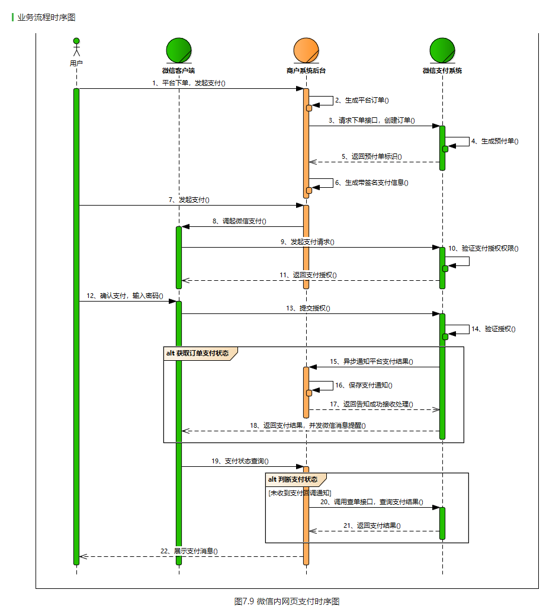

文档  http://beecloud.cn/doc/payapply/?index=3

# 微信支付

## 支付产品
### 1. 付款码支付  
付款码支付是用户展示微信钱包内的“刷卡条码/二维码”给商户系统扫描后直接完成支付
的模式。主要应用线下面对面收银的场景。

### 2. Native支付
Native支付是商户系统按微信支付协议生成支付二维码，用户再用微信“扫一扫”完成支付
的模式。该模式适用于PC网站支付、实体店单品或订单支付、媒体广告支付等场景。

### 3. JSAPI网页支付

JSAPI网页支付，即日常所说的公众号支付，可在微信公众号、朋友圈、聊天会话中点击页
面链接，或者用微信“扫一扫”扫描页面地址二维码在微信中打开商户HTML5页面，在页面
内下单完成支付。

### 4. APP支付
APP支付是指商户已有的APP，通过对接微信支付API及SDK，实现从商户APP发起交易后跳转
到微信APP，用户完成支付后跳回商户APP的场景。

### 5. H5支付
H5支付主要是在手机、ipad等移动设备中通过浏览器来唤起微信支付的支付产品。

### 6. 小程序支付
小程序支付是指在商户既有的小程序内通过对接微信支付API，实现用户在小程序内完成交易的场景。

## 支付账户
包含的数据有 
- APPID	appid
- 微信支付商户号	mch_id
- API密钥	key	

交易过程生成签名的密钥，仅保留在商户系统和微信支付后台，不会在网络中传播。商户妥
善保管该Key，切勿在网络中传输，不能在其他客户端中存储，保证key不会被泄露。商户可
根据邮件提示登录微信商户平台进行设置。也可按以下路径设置：微信商户平台
(pay.weixin.qq.com)-->账户中心-->账户设置-->API安全-->设置API密钥

- Appsecret	secret

AppSecret是APPID对应的接口密码，用于获取接口调用凭证access_token时使用。在微信支
付中，先通过OAuth2.0接口获取用户openid，此openid用于微信内网页支付模式下单接口使
用。可登录公众平台-->微信支付，获取AppSecret（需成为开发者且账号没有异常状态）。

## 接口规则
### 协议规则

商户接入微信支付，调用API必须遵循以下规则：

| 传输方式 | 为保证交易安全性，采用HTTPS传输                                            |
| 提交方式 | 采用POST方法提交                                                           |
| 数据格式 | 提交和返回数据都为XML格式，根节点名为xml                                   |
| 字符编码 | 微信支付API v2仅支持UTF-8字符编码的一个子集：使用一至三个字节编码的字符。  |
| 签名算法 | MD5/HMAC-SHA256                                                            |
| 签名要求 | 请求和接收数据均需要校验签名，详细方法请参考安全规范-签名算法              |
| 证书要求 | 调用申请退款、撤销订单、红包接口等需要商户api证书，各api接口文档均有说明。 |
| 判断逻辑 | 先判断协议字段返回，再判断业务返回，最后判断交易状态                       |

特别提示：

必须严格按照API的说明进行一单一支付，一单一红包，一单一付款，在未得到支付系统明
确的回复之前不要换单，防止重复支付或者重复付款

### 参数规定
#### 1、交易金额
交易金额默认为人民币交易，接口中参数支付金额单位为【分】，参数值不能带小数。对账单中的交易金额单位为【元】。

外币交易的支付金额精确到币种的最小单位，参数值不能带小数点。

#### 2、交易类型trade_type

JSAPI--JSAPI支付（或小程序支付）、NATIVE--Native支付、APP--app支付，MWEB--H5支付，
不同trade_type决定了调起支付的方式，请根据支付产品正确上传

MICROPAY--付款码支付，付款码支付有单独的支付接口，所以接口不需要上传，该字段在对账单中会出现

#### 3、货币类型
境内商户号仅支持人民币

CNY：人民币

#### 4、时间
标准北京时间，时区为东八区；如果商户的系统时间为非标准北京时间。参数值必须根据商
户系统所在时区先换算成标准北京时间， 例如商户所在地为0时区的伦敦，当地时间为2014
年11月11日0时0分0秒，换算成北京时间为2014年11月11日8时0分0秒。

#### 5、时间戳
标准北京时间，时区为东八区，自1970年1月1日 0点0分0秒以来的秒数。注意：部分系统取到的值为毫秒级，需要转换成秒(10位数字)。

#### 6、商户订单号
商户支付的订单号由商户自定义生成，仅支持使用字母、数字、中划线-、下划线_、竖线|、
星号*这些英文半角字符的组合，请勿使用汉字或全角等特殊字符。微信支付要求商户订单
号保持唯一性（建议根据当前系统时间加随机序列来生成订单号）。重新发起一笔支付要使
用原订单号，避免重复支付；已支付过或已调用关单、撤销（请见后文的API列表）的订单
号不能重新发起支付。

#### 7、body字段格式

| 使用场景         | 支付模式          | 商品字段规则                               | 样例                    | 备注                                       |
| PC网站           | 扫码支付          | 浏览器打开的网站主页title名 -商品概述      | 腾讯充值中心-QQ会员充值 |                                            |
| 微信浏览器       | 公众号/小程序支付 | 商家名称-销售商品类目                      | 腾讯-游戏               | 线上电商，商家名称必须为实际销售商品的商家 |
| 门店扫码         | 公众号/小程序支付 | 店名-销售商品类目                          | 小张南山店-超市         | 线下门店支付                               |
| 门店扫码         | 扫码支付          | 店名-销售商品类目                          | 小张南山店-超市         | 线下门店支付                               |
| 门店付款码       | 付款码支付        | 店名-销售商品类目                          | 小张南山店-超市         | 线下门店支付                               |
| 第三方手机浏览器 | H5支付            | 浏览器打开的移动网页的主页title名-商品概述 | 腾讯充值中心-QQ会员充值 |                                            |
| 第三方APP        | APP支付           | 应用市场上的APP名字-商品概述               | 天天爱消除-游戏充值     |                                            |

#### 8、银行类型

| 字符型银行编码 | 银行名称           |
| ICBC_DEBIT     | 工商银行（借记卡） |
| ICBC_CREDIT    | 工商银行（信用卡） |
| ABC_DEBIT      | 农业银行（借记卡） |

### 安全规范
#### 1、签名算法
    （签名校验工具） https://pay.weixin.qq.com/wiki/tools/signverify/
签名生成的通用步骤如下：

第一步，设所有发送或者接收到的数据为集合M，将集合M内非空参数值的参数按照参数名ASCII码从小到大排序（字典序），使用URL键值对的格式（即key1=value1&key2=value2…）拼接成字符串stringA。

特别注意以下重要规则：

```
◆ 参数名ASCII码从小到大排序（字典序）；
◆ 如果参数的值为空不参与签名；
◆ 参数名区分大小写；
◆ 验证调用返回或微信主动通知签名时，传送的sign参数不参与签名，将生成的签名与该sign值作校验。
◆ 微信接口可能增加字段，验证签名时必须支持增加的扩展字段
```

第二步，在stringA最后拼接上key得到stringSignTemp字符串，并对stringSignTemp进行MD5运算，再将得到的字符串所有字符转换为大写，得到sign值signValue。 注意：密钥的长度为32个字节。
◆ key设置路径：微信商户平台(pay.weixin.qq.com)-->账户中心-->账户设置-->API安全-->设置API密钥

举例：
假设传送的参数如下：
``` 
appid： wxd930ea5d5a258f4f
mch_id： 10000100
device_info： 1000
body： test
nonce_str： ibuaiVcKdpRxkhJA
```

第一步：对参数按照key=value的格式，并按照参数名ASCII字典序排序如下：
``` 
stringA="appid=wxd930ea5d5a258f4f&body=test&device_info=1000&mch_id=10000100&nonce_str=ibuaiVcKdpRxkhJA";
```

第二步：拼接API密钥：

MD5签名方式：
``` 
stringSignTemp=stringA+"&key=192006250b4c09247ec02edce69f6a2d" //注：key为商户平台设置的密钥key
sign=MD5(stringSignTemp).toUpperCase()="9A0A8659F005D6984697E2CA0A9CF3B7" //注：MD5签名方式


HMAC-SHA256签名方式：
stringSignTemp=stringA+"&key=192006250b4c09247ec02edce69f6a2d" //注：key为商户平台设置的密钥key
sign=hash_hmac("sha256",stringSignTemp,key).toUpperCase()="6A9AE1657590FD6257D693A078E1C3E4BB6BA4DC30B23E0EE2496E54170DACD6" //注：HMAC-SHA256签名方式，部分语言的hmac方法生成结果二进制结果，需要调对应函数转化为十六进制字符串。
```

最终得到最终发送的数据：
``` xml
<xml>
<appid>wxd930ea5d5a258f4f</appid>
<mch_id>10000100</mch_id>
<device_info>1000</device_info>
<body>test</body>
<nonce_str>ibuaiVcKdpRxkhJA</nonce_str>
<sign>9A0A8659F005D6984697E2CA0A9CF3B7</sign>
</xml>
```

#### 2、生成随机数算法
微信支付API接口协议中包含字段nonce_str，主要保证签名不可预测。我们推荐生成随机数算法如下：调用随机数函数生成，将得到的值转换为字符串。

### 获取openid
微信公众平台：
openid是微信用户在公众号appid下的唯一用户标识（appid不同，则获取到的openid就不同），可用于永久标记一个用户，同时也是微信JSAPI支付的必传参数。

- 网页授权获取用户openid
- 小程序获取openid
- 公众号获取openid
- APP获取openid

## JSAPI支付
### 接入前准备
#### 一、设置支付目录
支付授权目录说明：

1、商户最后请求拉起微信支付收银台的页面地址我们称之为“支付目录”，例如：https://www.weixin.com/pay.php。
2、商户实际的支付目录必须和在微信支付商户平台设置的一致，否则会报错“当前页面的URL未注册：”

支付授权目录设置说明：
登录微信支付商户平台（pay.weixin.qq.com）-->产品中心-->开发配置，设置后一般5分钟内生效。

支付授权目录校验规则说明：

1、如果支付授权目录设置为顶级域名（例如：https://www.weixin.com/ ），那么只校验顶级域名，不校验后缀；
2、如果支付授权目录设置为多级目录，就会进行全匹配，例如设置支付授权目录为https://www.weixin.com/abc/123/，则实际请求页面目录不能为https://www.weixin.com/abc/，也不能为https://www.weixin.com/abc/123/pay/，必须为https://www.weixin.com/abc/123/


#### 二、设置网页授权域名
开发JSAPI支付时，在统一下单接口中要求必传用户openid，而获取openid则需要您在公众
平台设置获取openid的域名，只有被设置过的域名才是一个有效的获取openid的域名，否则
将获取失败。

### 开发指引


### JSAPI 调起支付
在微信浏览器里面打开H5网页中执行JS调起支付。接口输入输出数据格式为JSON。
注意：WeixinJSBridge内置对象在其他浏览器中无效。

getBrandWCPayRequest参数以及返回值定义：

1、网页端接口请求参数列表（参数需要重新进行签名计算，参与签名的参数为：appId、timeStamp、nonceStr、package、signType，参数区分大小写。）

| 名称               | 变量名    | 必填 | 类型        | 示例值                           | 描述                                                                          |
| 公众号id           | appId     | 是   | String(16)  | wx8888888888888888               | appId为当前服务商号绑定的appid                                                |
| 时间戳             | timeStamp | 是   | String(32)  | 1414561699                       | 当前的时间，其他详见时间戳规则                                                |
| 随机字符串         | nonceStr  | 是   | String(32)  | 5K8264ILTKCH16CQ2502SI8ZNMTM67VS | 随机字符串，不长于32位。推荐随机数生成算法                                    |
| 订单详情扩展字符串 | package   | 是   | String(128) | prepay_id=123456789              | 统一下单接口返回的prepay_id参数值，提交格式如：prepay_id=***                  |
| 签名方式           | signType  | 是   | String(32)  | MD5                              | 签名类型，默认为MD5，支持HMAC-SHA256和MD5。注意此处需与统一下单的签名类型一致 |
| 签名               | paySign   | 是   | String(64)  | C380BEC2BFD727A4B6845133519F3AD6 | 签名，详见签名生成算法                                                        |

2、返回结果值说明

| 返回值                         | 描述               |
| get_brand_wcpay_request:ok     | 支付成功           |
| get_brand_wcpay_request:cancel | 支付过程中用户取消 |
| get_brand_wcpay_request:fail   | 支付失败           |

注：JS API的返回结果get_brand_wcpay_request:ok仅在用户成功完成支付时返回。由于前端交互复杂，get_brand_wcpay_request:cancel或者get_brand_wcpay_request:fail可以统一处理为用户遇到错误或者主动放弃，不必细化区分。

示例代码如下：

``` js
function onBridgeReady(){
   WeixinJSBridge.invoke(
      'getBrandWCPayRequest', {
         "appId":"wx2421b1c4370ec43b",     //公众号ID，由商户传入     
         "timeStamp":"1395712654",         //时间戳，自1970年以来的秒数     
         "nonceStr":"e61463f8efa94090b1f366cccfbbb444", //随机串     
         "package":"prepay_id=u802345jgfjsdfgsdg888",     
         "signType":"MD5",         //微信签名方式：     
         "paySign":"70EA570631E4BB79628FBCA90534C63FF7FADD89" //微信签名 
      },
      function(res){
      if(res.err_msg == "get_brand_wcpay_request:ok" ){
      // 使用以上方式判断前端返回,微信团队郑重提示：
            //res.err_msg将在用户支付成功后返回ok，但并不保证它绝对可靠。
      } 
   }); 
}
if (typeof WeixinJSBridge == "undefined"){
   if( document.addEventListener ){
       document.addEventListener('WeixinJSBridgeReady', onBridgeReady, false);
   }else if (document.attachEvent){
       document.attachEvent('WeixinJSBridgeReady', onBridgeReady); 
       document.attachEvent('onWeixinJSBridgeReady', onBridgeReady);
   }
}else{
   onBridgeReady();
}
```

3、客户端唤起支付常见错误

| 序号 | 错误描述                         | 解决方法                                   |
| 1    | 调用支付JSAPI缺少参数：total_fee | 1、请检查预支付会话标识prepay_id是否已失效 |
| 1    | 调用支付JSAPI缺少参数：total_fee | 2、请求的appid与下单接口的appid是否一致    |

# 微信支付服务商
## 接入流程
[接入服务商和特约商户进件](https://pay.weixin.qq.com/wiki/doc/apiv3_partner/open/pay/chapter7_1_2.shtml)

## 特约商户进件资料
1、营业执照拍照

2、法人身份证，正反面拍照

3、个体户提供法人银行卡卡号；企业提供开户支行（公司对公账户）

4、提供管理员：姓名、手机号、邮箱。

5、取一个商户名称

6、小程序、公众号则APPID和截图2张；实体门店则门店LOGO和门店/办公环境照片2张；
    
## 参数说明
[行业编码、费率](https://pay.weixin.qq.com/wiki/doc/apiv3/terms_definition/chapter1_1_3.shtml)


    
