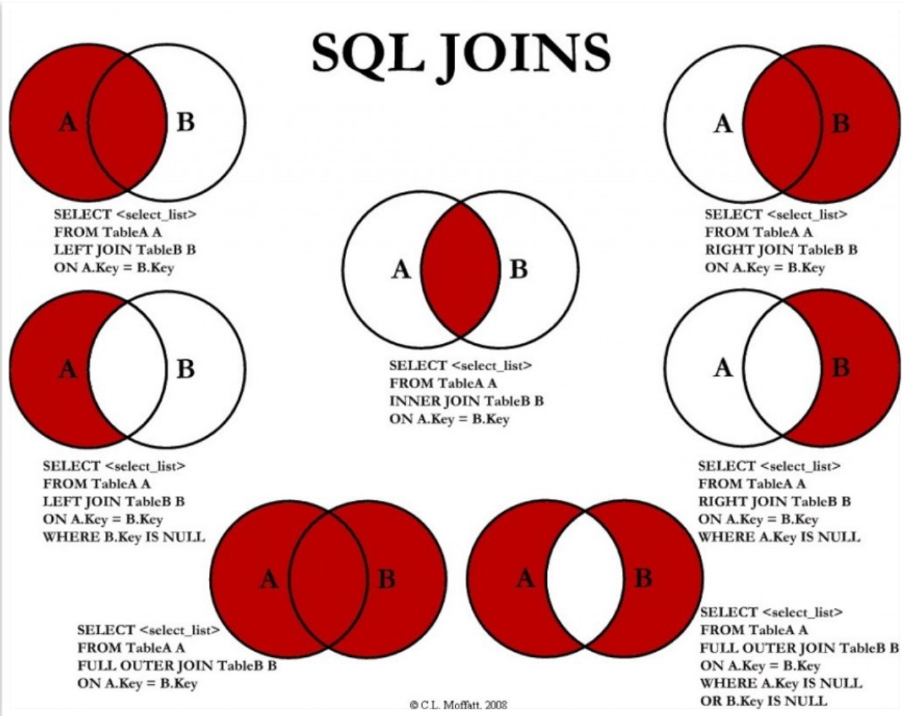

## MySQL



   mysql -h hostname -u username -p

   
## 性能

- 显示性能(语句执行时间)  show profiles;
- 如果没有，要打开开关  set profiling =1;
- 查看操作行数  explain select * from event(表名);

## datetime 报错
原因:在命令行窗口查看当前的sql_mode配置:

select @@sql_mode;

结果如下:
ONLY_FULL_GROUP_BY, STRICT_TRANS_TABLES, NO_ZERO_IN_DATE, NO_ZERO_DATE,
ERROR_FOR_DIVISION_BY_ZERO, NO_AUTO_CREATE_USER, and NO_ENGINE_SUBSTITUTION
其中NO_ZERO_IN_DATE, NO_ZERO_DATE两个选项禁止了0000这样的日期和时间。因此在mysql的配置文件中，重新设置sql_mode，去掉这两项就可以了。

```
ONLY_FULL_GROUP_BY,STRICT_TRANS_TABLES,ERROR_FOR_DIVISION_BY_ZERO,NO_AUTO_CREATE_USER,NO_ENGINE_SUBSTITUTION
```
Linux系统下:

修改my.cnf文件，在[mysqld]中添加

sql-mode=ONLY_FULL_GROUP_BY,STRICT_TRANS_TABLES,ERROR_FOR_DIVISION_BY_ZERO,NO_AUTO_CREATE_USER,NO_ENGINE_SUBSTITUTION 
1
修改完成一定重启MySQL


1.windows系统下:
使用 SET [SESSION|GLOBAL] sql_mode='modes'
注意:SESSION(默认选项):表示当前回话中生效;GLOBAL(需重启):表示全局生效

也可以修改my.ini配置文件

演示: 
    SET GLOBAL sql_mode='ONLY_FULL_GROUP_BY,STRICT_TRANS_TABLES, 
    ERROR_FOR_DIVISION_BY_ZERO,NO_AUTO_CREATE_USER,NO_ENGINE_SUBSTITUTION'


case

SELECT counterType, CASE counterType
WHEN 1 THEN 'CTP'
WHEN 2 THEN 'NULL'
WHEN 3 THEN '飞鼠'
WHEN 4 THEN '飞鼠 FIX'
WHEN 5 THEN 'CTP FIX'
WHEN 6 THEN 'QuantHub'
ELSE 'default'
END AS counterName
FROM urls