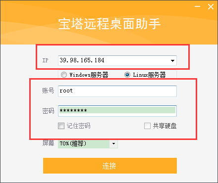
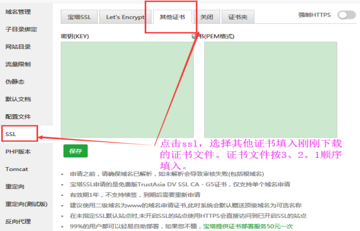

## 购买服务器

推荐购买阿里云ECS服务器

配置服务器

- 1. 计费方式： 包年或包月 2核4GB
- 2. 镜像 Centos 64
- 3. 存储 40G

网络和带宽
- 公网带宽 5M

系统配置
- 登录凭证 root + password

服务器系统配置安装

进入宝塔 https://www.bt.cn/ ，下载 **远程桌面连接工具**，用配置的账号密码连接，复制安装命令执行，建议选 apache环境

## ssl证书制作 (小程序或https)

最简单方法：在腾讯云https://cloud.tencent.com 网站上面制作，有免费的域名ssl证书制作可用。

点击产品，搜索 ssl 证书 ，立即购买(域名型免费版)，配置好后，进行申请

!注意：现在收费了

## 证书管理
进入证书详情——基础信息——添加DNS验证——将下面的主机记录值和记录值复制到域名解析的地方，进行DNS验证

下载证书,然后在宝塔创建的 网站中，添加ssl 证书，
密匙key 填入 key文件 , pem 填入 两个crt文件 (切记复制文件2之后回车下，再复制文件1 ，避免出错)

