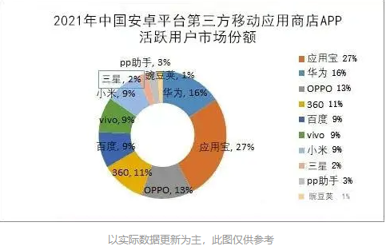
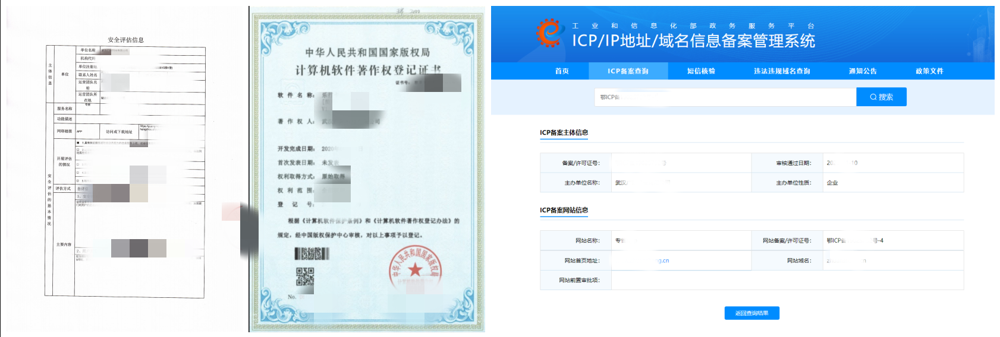

https://www.jianshu.com/p/01431e3ce176

## app 上架流程

###  Android app

- app 上架到应用市场

#### 2021 应用市场格局

应用宝>华为>OPPO>360>小米>百度>vivo>三星>pp助手>豌豆荚

#### 上架准备材料

 1. APP安全评估报告、软件著作权登记证书、ICP备案

把APP名称+产品说明文档+软件安装包提交到相关机构检测合格即可获得，此三项是APP上架必须提供的，申请周期一般为一到两周（具体时间跟价格有关，时间越短价格越高），特殊行业需要提供其他证明或授权（如金融相关、新闻相关、直播相关）

2. 准备软件相关的基本信息：应用icon/介绍/截图/应用安卓包/测试账号（首次上架版本均为v1.0.0），截图要提前准备，不同平台尺寸要求均不同，一般为480*800或者1080*1920，设计样机也行。

3、首次上架应用市场可能会要求对安装包进行加固，应用宝和360应用商店会提供加固工具，这步请由专业人士操作。

4、准备应用上架承诺书（免责函）、权限获取声明、APP隐私政策声明及网址（以上应用市场均有提供模板）。

5、相关资质均整理好形成PDF留存，以便作为附件资料上传。

#### 上架步骤
1.注册账号并提交企业资质（准备企业名下的手机号、邮箱、营业执照、许可证、法人手持身份证正反面、法人身份证复印件加盖公章、公户开票信息即可）；

2.企业资质合格后做好平台渠道统计，新建软件信息并上传安装包和基本信息；

3.提交相关软件著作权证明，权限说明，保证函等，反复核对后提交等待审核结果；

4.大概3-4个工作日就会有审核结果的邮件至邮箱中。

（注意：提交应用绝对不能随便删除，否则后面再提交会显示应用包名冲突，会要求走应用认领流程，那个时候就会相当麻烦啦。此步骤仅为提交操作指引，有不清楚的可以直接咨询对应平台的客服进行咨询解答。）

#### 上架地址及难易程度
重要提示：开发者QQ号码一旦注册不能变更，建议使用公司老板或法人的QQ号码而不是员工私人号码注册，以免遇到员工离职等情况造成不必要的麻烦。

1、腾讯应用宝

腾讯开放平台地址：https://open.tencent.com/

## 软著更改名字要准备的材料

https://register.ccopyright.com.cn/account.html?current=soft_register

1.填写《软件登记事项变更或补充申请表》，其中“变更理由说明”栏务必填写清楚

2.原著作登记证书复印件加盖公章份

3.营业执照副本复印件加盖公章份

4.单独用a4纸拟一份《变更理由》，加盖公章

5.下载《代理委托书》，填写软件名称并加盖公章