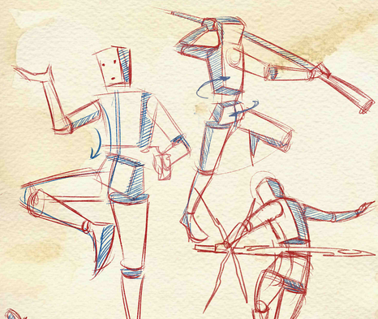

## 学习 (知识，认知)

### 第一步，明确目标

明确在什么情况下，才要学习，看书。而看书的目的又是想达到什么！
明确自己学习要达到什么样的目的，学习的内容是否能保证向那个目的进展。

在学习开始前，要多问问自己，**学习技能要达到什么效果。**这是最重要的，没有之一。

比如，你想学尤克里里，最终是想演奏哪个曲子；你想学编程，最终是想做出什么功能的软件？

### 第二步，分解技能

根据我的经验，划分技能的最好方式，是根据书籍的目录来划分。打开一本书，翻到目录页，就能看到各个篇章。通常，每个篇章都是一个小技能，而每一节是更小的技能。

在这些小技能中，哪些能实现目标效果，接下来就学习、练习那些技能，我把这些称为**「必要技能」**。对于那些不影响目标的技能，大可放心舍弃。

### 第三步，学习理论

如果不学习理论知识，在练习中犯了错，自己也很难发现。所以，有必要学习理论知识。

但是，不是说，要把所有的理论知识都学完，再开始练习。总不能读完20本PS相关的书籍，再开始练习PS吧。

要怎么学习理论知识呢？

要**学习最少且必要的理论知识，就是说，只要理论能覆盖第一步的「必要技能」即可，我把它称为「必要理论」。**

关于理论学习，我总结了一个模板。**一个理论总包含这个几块，这个理论是什么，为什么要使用这个理论才能奏效，这个理论有怎样的步骤，这个理论有什么好处和不足。** 实际学习的时候，可能只需要掌握几个，而不需要全部掌握。

比如，学习编程中的函数，你要知道函数是个什么东东、一般在什么情况下用，如何使用，以及用了有什么好处。

### 第四步，准备工具

要学习技能，必备的工具不可少。

如果是学习PS，那么要有个电脑，然后还要安装Photoshop软件。

如果是学习编程，那么，要有电脑，还要有对应的开发环境。

总之，要准备最少且必要的工具。

### 第五步，排除干扰

如果可能，关闭手机、电视、电脑吧。

这些干扰的存在，只会阻碍我们的进步。

### 第六步，练习至少20小时

反复练习**「必要技能」**。一天练习1小时，连续练习20天即可，或者练习一个月，中间歇几天也无妨。
