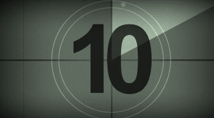
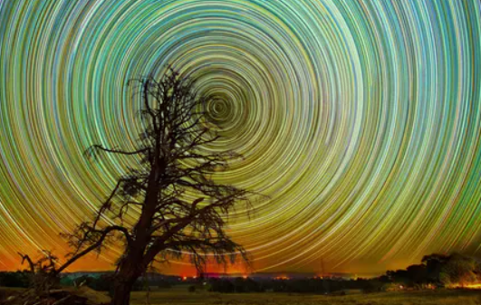
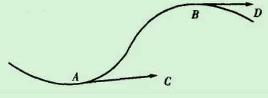

## 拍摄
使用成像设备 记录 影像

### 平滑过渡 (转场)

#### 遮挡物过渡
第一段视频素材以遮挡作为结束，第二段视频以遮挡作为开始。

#### 同向运镜过渡
是指相同的运镜方向或者相似的人物动作之间的衔接，给人带来视觉上比较自然的两个画面的切换。

### 让视频更动感 (对于运行缓慢的)

- 多拍延时摄影画面 
- 移动运镜拍摄
- 后期剪辑做曲线变速处理

### 调色 
一般 增加 30% 的 锐化，增加清晰感