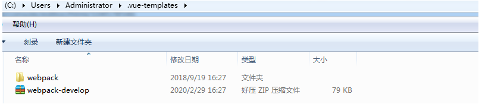

https://github.com/hardphp/tp6-vue-admin.git
https://github.com/icarusion/vue-book
https://github.com/sg552/happy_book_vuejs.git


# Vue2 (构建视图)


当前的web页面分为2种，

- 1. 传统页面，特点是 一个个页面独立加载所有资源然后进行渲染，但在手机端很慢。
- 2. 单页应用, 特点是 点击链接，不是整页刷新，而是局部刷新，用的技术是 ajax(异步请求)

- jQuery 流行后，ajax 请求非常方便

``` js
jQuery.get("http://url?par=1",function(data){});
```

- 现在的移动开发 ，web 端 使用 SPA H5 框架，框架包含，路由，历史记录，事件处理，组件等功能

## 安装vue

```
$ npm install vue vue-cli -g
```

`-g` 表示这个包安装后可以被全局使用。 

### 创建vue项目

创建一个基于 webpack 模板的新项目:

```
$ vue init webpack my-project
```
如果网络不好，进行离线下载到本地用户目录下的.vue-templates目录下
https://github.com/vuejs-templates/webpack



```
vue init webpack vuedemo --offline
```

安装依赖:

```
$ cd my-project
$ cnpm install
```

以默认端口来运行：

```
$ npm run dev
```

## 开发模式的演化
### 传统MVC的缺点

- 1. 前端开发中的依赖开发环境
- 2. 前后端职责纠缠不清
- 3. 对前端发挥的局限性
- MVVM 把视图中的数据 与 单独的数据进行双向绑定
### 前端MVC的产生(前后端分离) -> nodejs全栈


- assets 文件夹

用到的图片都可以放在这里。

- components

用到的"视图"和"组件"所在的文件夹。（最最核心）

- router/index.js  

路由文件。 定义了各个页面对应的url. 

- App.vue

如果index.html 是一级页面模板的话，这个App.vue就是二级页面模板。
所有的其他vuejs页面，都作为该模板的 一部分被渲染出来。

- main.js

没有实际的业务逻辑，但是为了支撑整个vuejs框架，存在很必要。

## 对象

- el (用来绑定模板 )
- data
- methods
- 生命周期 created mounted(元素挂载时执行) updated,beforeDestory,destoryed


``` js
new Vue({
  el: ".app1",
  data: {
    name: "aming",
  },
  methods: {},
  created: function () {
    console.log("Vue instance has been created");
  },
  filters:{
	  upper:function(value){
		  return value.toUpperCase();
	  }
  }
});
```

## 模板
### 内容

#### 文本节点
```
{{datavar}}
```
#### html 
``` html
 <div v-html="message"></div>
```
#### 属性 
``` html
<span v-bind:style="style1">属性</span>
<div v-bind:id="'list-' + id">ID</div>
```
#### 表达式
``` html
{{5+5}}<br>
{{ ok ? 'YES' : 'NO' }}<br>
{{ message.split('').reverse().join('') }}

```

### 指令 
#### 判断
``` html
 <div v-if="type === 'A'">
      A
    </div>
    <div v-else-if="type === 'B'">
      B
    </div>
    <div v-else-if="type === 'C'">
      C
    </div>
    <div v-else>
      Not A/B/C
    </div>
```
#### 循环
``` html
<li v-for="site in sites">
      {{ site.name }}
    </li>
```

### 数据与表单形成关联
``` html
<input v-model="message">
```

v-model与 input ,select ,textarea,checkbox,radio 等表单形成关联

### 与事件属性关联 v-on

方法放在 methods 中
### 过滤filters  {{ a | b}}

### 条件 ###

``` html
<div id="app">
    <div v-if="Math.random() > 0.5">
      Sorry
    </div>
    <div v-else>
      Not sorry
    </div>
</div>

```

#### 监听属性 watch ####

``` html
<div id = "app">
    <p style = "font-size:25px;">计数器: {{ counter }}</p>
    <button @click = "counter++" style = "font-size:25px;">点我</button>
</div>
<script type = "text/javascript">
var vm = new Vue({
    el: '#app',
    data: {
        counter: 1
    }
});
vm.$watch('counter', function(nval, oval) {
    alert('计数器值的变化 :' + oval + ' 变为 ' + nval + '!');
});
</script>
``` 

#### 样式绑定 ####

##### class #####

实例中将 isActive 设置为 true 显示了一个绿色的 div 块，如果设置为 false 则不显示：
``` html
<div v-bind:class="{ 'active': isActive }"></div>
``` 
用数组处理多种 class
``` html
<div v-bind:class="[errorClass ,isActive ? activeClass : '']"></div>
```

##### style #####

``` html
<div v-bind:style="{ color: activeColor, fontSize: fontSize + 'px' }">菜鸟教程</div>
<!-- 或者绑定样式对象 -->
<div v-bind:style="styleObject">菜鸟教程</div>
```

### 事件 ###
#### 事件修饰符 ####

``` html
<!-- 阻止单击事件冒泡 -->
<a v-on:click.stop="doThis"></a>
<!-- 提交事件不再重载页面 -->
<form v-on:submit.prevent="onSubmit"></form>
<!-- 修饰符可以串联  -->
<a v-on:click.stop.prevent="doThat"></a>
<!-- 只有修饰符 -->
<form v-on:submit.prevent></form>
<!-- 添加事件侦听器时使用事件捕获模式 -->
<div v-on:click.capture="doThis">...</div>
<!-- 只当事件在该元素本身（而不是子元素）触发时触发回调 -->
<div v-on:click.self="doThat">...</div>

<!-- click 事件只能点击一次，2.1.4版本新增 -->
<a v-on:click.once="doThis"></a>
``` 

#### 按键修饰符 ####

``` html
<!-- 只有在 keyCode 是 13 时调用 vm.submit() -->
<input v-on:keyup.13="submit">
记住所有的 keyCode 比较困难，所以 Vue 为最常用的按键提供了别名：
<!-- 同上 -->
<input v-on:keyup.enter="submit">
<!-- 缩写语法 -->
<input @keyup.enter="submit">
``` 
别名
```
.enter
.tab
.delete (捕获 "删除" 和 "退格" 键)
.esc
.space
.up
.down
.left
.right
.ctrl
.alt
.shift
.meta
``` 


### 表单 v-model 双向绑定 ###

修饰符

#### .lazy ####

``` html
<!-- 在 "change" 而不是 "input" 事件中更新 -->
<input v-model.lazy="msg" >
```

#### .number ####

如果想自动将用户的输入值转为 Number 类型（如果原值的转换结果为 NaN 则返回原值），可以添加一个修饰符 number 给 v-model 来处理输入值：
``` html
<input v-model.number="age" type="number">
```
这通常很有用，因为在 type="number" 时 HTML 中输入的值也总是会返回字符串类型。

#### .trim ####

如果要自动过滤用户输入的首尾空格，可以添加 trim 修饰符到 v-model 上过滤输入：
``` html
<input v-model.trim="msg">
```


# link
  <a :href="'addalarmnotes.do?alarmId='+item.id+'&activetype1=detail'" target="_blank">{{item.name}}</a>

# Vue.js
## 组件
``` js
// 定义一个名为 button-counter 的新组件
Vue.component('button-counter', {
  data: function () {
    return {
      count: 0
    }
  },
  template: '<button v-on:click="count++">You clicked me {{ count }} times.</button>'
})
```

## 模板

jsx 语法 
``` jsx
Vue.component('buttonclicked', {
  props: ["initial_count"],
  data: function() {var q = {"count": 0}; return q;} ,
  render: function (h) {
    return (<button vOn:click={this.onclick}>Clicked {this.count} times</button>)
  },
  methods: {
    "onclick": function() {
      this.count = this.count + 1;
    }
  },
  mounted: function() {
    this.count = this.initial_count;
  }
});

```
## vue-router 页面跳转

- 安装  npm install vue-router --save-dev
