## wordpress
内容管理系统

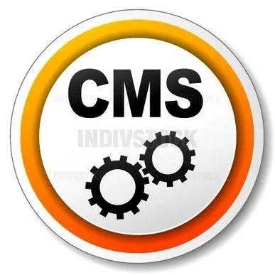

### 安装
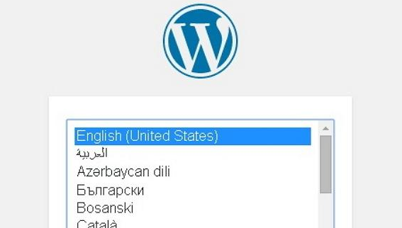

### 设置
- 通用设置
- 写作设置

### 类别

- 添加类别
- 编辑类别

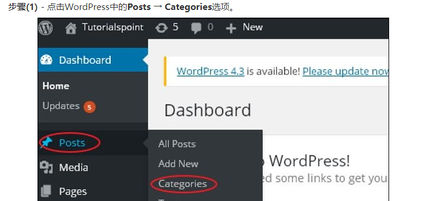

### 贴子

- 添加贴子
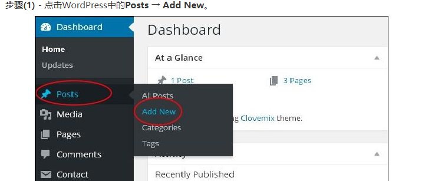

### 媒体库
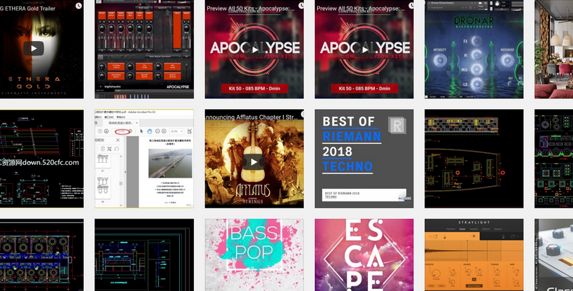

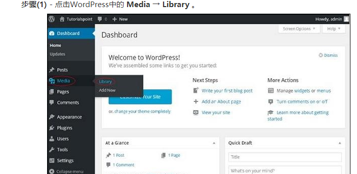

### 页面
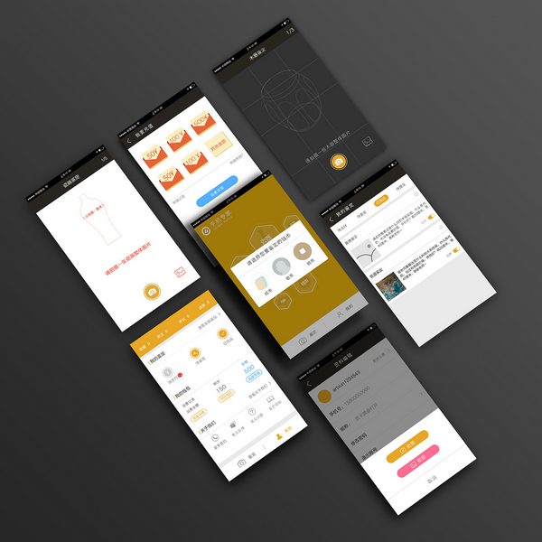
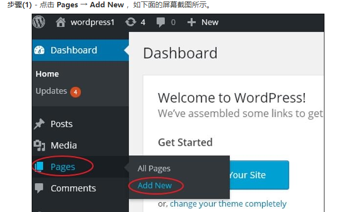

### 标签
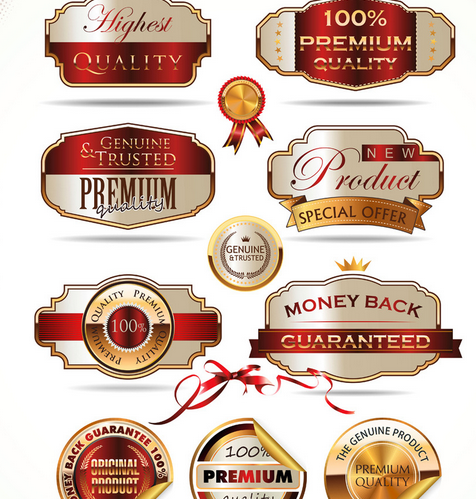
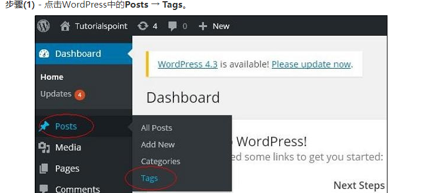

### 链接 (就是超链接)

### 评论

### 插件
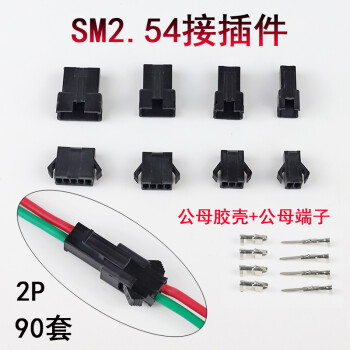
单击 Plugins → Installed Plugins

### 外观

- 主题
- 窗口管理
- 背景

## Elementor 教程

