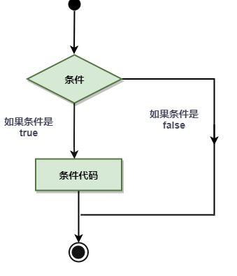
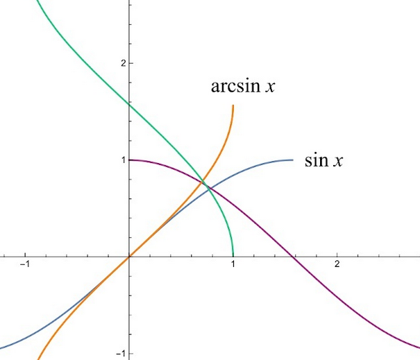
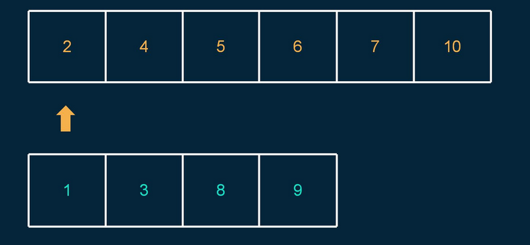

## go


### 入门


#### hello,world


#### 命令行 参数


### 结构


#### 变量


人也是变量


> 短变量声明


#### 常量


```go
package main

import "fmt"

func main() {
   const LENGTH int = 10
   const WIDTH int = 5  
   var area int
   const a, b, c = 1, false, "str" //多重赋值

   area = LENGTH * WIDTH
   fmt.Printf("面积为 : %d", area)
   println()
   println(a, b, c)  
}
```

#### 运算符


```
+	 -	 *	 /	 %
```


#### 条件




#### 循环


#### 函数


```go
func function_name( [parameter list] ) [return_types] {
   函数体
}
```

#### 数组

```go
var balance = [5]float32{1000.0, 2.0, 3.4, 7.0, 50.0}
```

#### 指针


#### Map(集合)


```go
package main

import "fmt"

func main() {
    var countryCapitalMap map[string]string /*创建集合 */
    countryCapitalMap = make(map[string]string)

    /* map插入key - value对,各个国家对应的首都 */
    countryCapitalMap [ "France" ] = "巴黎"
    countryCapitalMap [ "Italy" ] = "罗马"
    countryCapitalMap [ "Japan" ] = "东京"
    countryCapitalMap [ "India" ] = "新德里"

    /*使用键输出地图值 */
    for country := range countryCapitalMap {
        fmt.Println(country, "首都是", countryCapitalMap [country])
    }

    /*查看元素在集合中是否存在 */
    capital, ok := countryCapitalMap [ "American" ] /*如果确定是真实的,则存在,否则不存在 */
    /*fmt.Println(capital) */
    /*fmt.Println(ok) */
    if (ok) {
        fmt.Println("American 的首都是", capital)
    } else {
        fmt.Println("American 的首都不存在")
    }
}
```