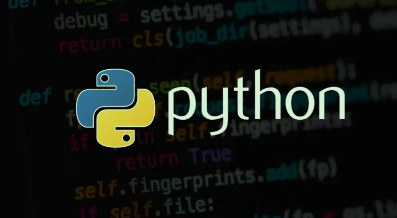

Python 


## 正则表达式

### 特殊符号和字符

有特定语义

| 表示法 | 描述         | 示例      |
| ------ | ------------ | --------- |
| .      | 匹配任意字符 | b.b       |
| ^      | 匹配字符开头 | ^Dear     |
| $      | 匹配字符结尾 | /bin/*sh$ |

特殊字符

| 表示法       | 描述                                    | 示例         |
| ------------ | --------------------------------------- | ------------ |
| \d           | 匹配数字 ，与 [0-9]一致                 | data\d+.tx   |
| \w           | 匹配任何字母数字字符,与[A-Za-z0-9_]相同 | [A-Za-z_]\w+ |
| [0-9]{15,16} | 匹配 15 或者 16 个数字(例如信用卡号码)  |              |


### re模块:核心函数和方法

| 函数/方法                       | 描 述                                      |
| ------------------------------- | ------------------------------------------ |
| match(pattern, string ,flags=0) | 成功,就返回 匹配对象;失败,就返回 None      |
| group(num=0)                    | 返回整个匹配对象,或者编号为 num 的特定子组 |


匹配好了，输出配对字符串
```python
result=re.match("helo","heloo",0).group()
print(result)
```

常用模块属性

| 函数/方法            | 描述               |
| -------------------- | ------------------ |
| re.I、 re.IGNORECASE | 不区分大小写的匹配 |
