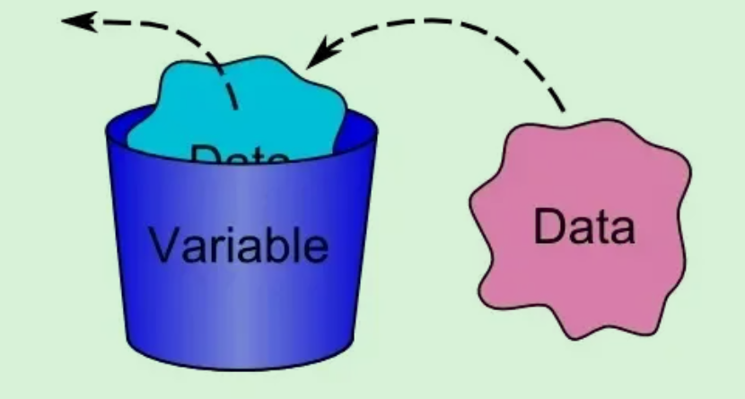
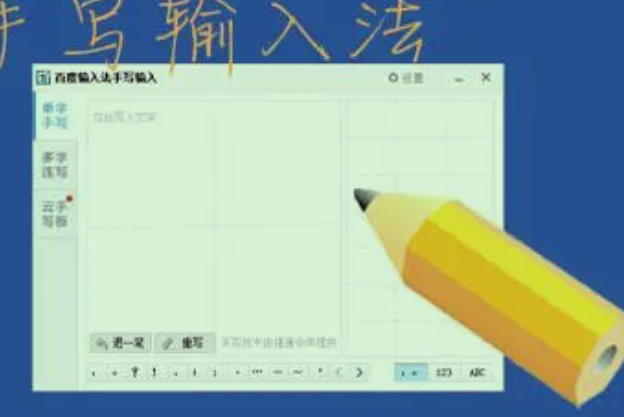
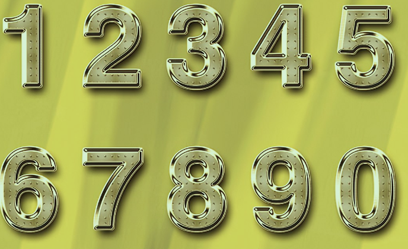
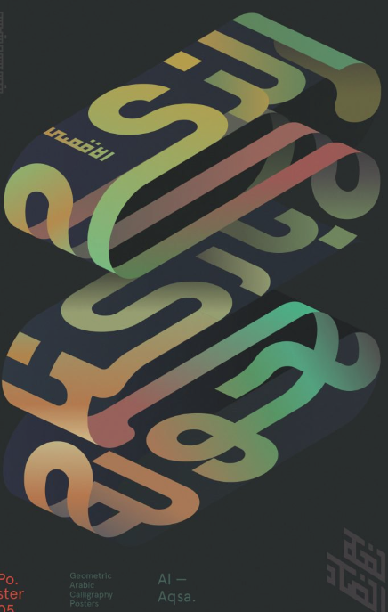
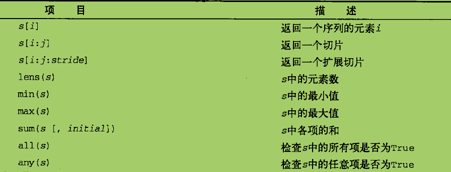

## 翻译器


## 查看 Python 版本

```sh
python -v
```


## 输出 "Hello World！"


## 数据类型


## 变量赋值


## 输入 input



## 对象


```python
duixiang={
    "name":"桌子",
    "lang":"汉语",
    "bianchang": (30,50)
}
```

## 数字


```python
print(1,2,4)
```
## 文字



```python
print("文字")
```

## 命令


## 序列
适用于所有序列的操作和方法

