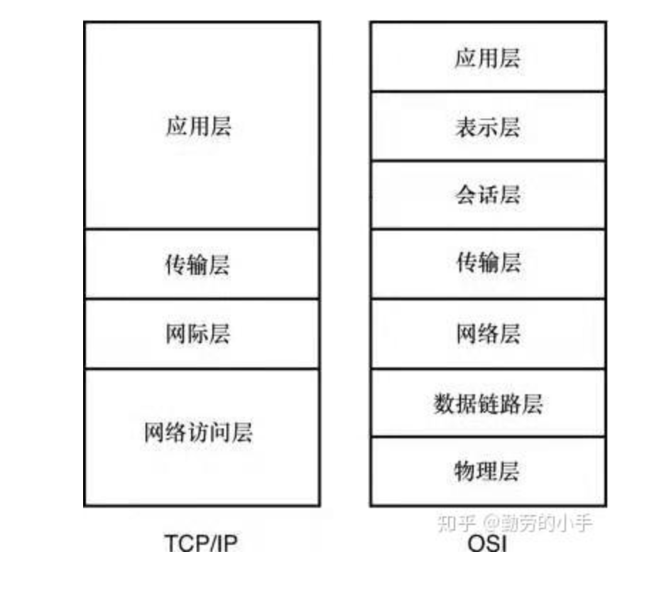

[单机处理事情]--------------------[单机处理]
    |
    |
    |
    |
[单机处理事情]

网络：联网的计算机可以共享资源，共同协作
重点：识别不同节点 （网络节点标识ID: IP）

网络节点通信协议：OSI 或TCP/IP 协议

- 应用层
- 传输层
- 网际层
- 网络访问层

> 跟快递运输差不多，中转节点只需要中转分快递的人员，而不需要拆解快递的人员。

socket:(IP+port)，确定某一网络节点的对应网络应用进程，通用的几个服务的端口都是确定的。

# 网络物理层传输技术
- 有线：双绞线
- 无线： wifi,蓝牙，红外线

# VPN
相当于局域网专线的广域版

# Internet(互联网技术)

- IPV4:决定某些身份证可以联网
- IPV6: 允许更多的设备接入互联网