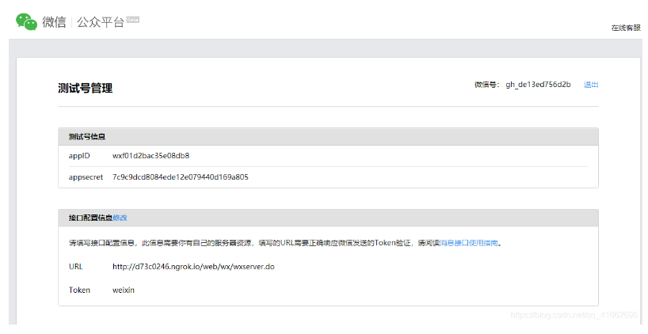

简单文章发布不需要配置开发服务器，当要获取用户信息（openid），则需要配置开发服务器。

<!--more-->
## 配置开发服务器

微信公众平台->开发->开发者工具->公众平台测试账号

- appid:是微信公众号的唯一标识，通过和appsecret进行验证。
- URL:开发服务器的路径，接收微信服务器发送的数据。
- Token：自设定的token，和开发服务器中进行验证的token保持一致。

如果你是用本地tomcat，可以使用像ngrok这样的内网穿透工具，生成一个外网域名，通过域名访问本地localhost:8080.

开发者提交信息后，微信服务器将发送GET请求到填写的服务器地址URL上，**GET请求**携带参数如下表所示：

| 参数 | 描述 |
| --- | --- |
| signature | 微信加密签名，signature结合了开发者填写的token参数和请求中的timestamp参数、nonce参数。 |
| timestamp | 时间戳 |
| nonce | 随机数 |
| echostr | 随机字符串 |

根据这三个参数，在开发服务器里面重新sha1算法加密，生成新的signature，然后和请求参数中的signature比较，相同则验证成成，成功之后返回随机字符串。配置阶段则成功。

## 获取access_token

调用微信的接口先要获取调用权限 access_token

1、建议公众号开发者使用中控服务器统一获取和刷新access_token，其他业务逻辑服务器所使用的access_token均来自于该中控服务器，不应该各自去刷新，否则容易造成冲突，导致access_token覆盖而影响业务；

2、目前access_token的有效期通过返回的expire_in来传达，目前是7200秒之内的值。中控服务器需要根据这个有效时间提前去刷新新access_token。在刷新过程中，中控服务器可对外继续输出的老access_token，此时公众平台后台会保证在5分钟内，新老access_token都可用，这保证了第三方业务的平滑过渡；

3、access_token的有效时间可能会在未来有调整，所以中控服务器不仅需要内部定时主动刷新，还需要提供被动刷新access_token的接口，这样便于业务服务器在API调用获知access_token已超时的情况下，可以触发access_token的刷新流程。

**接口调用请求说明**

```
https请求方式: GEThttps://api.weixin.qq.com/cgi-bin/token?grant_type=client_credential&appid=APPID&secret=APPSECRET
```

**参数说明**

| 参数 | 是否必须 | 说明 |
| --- | --- | --- |
| grant\_type | 是 | 获取access\_token填写client\_credential |
| appid | 是 | 第三方用户唯一凭证 |
| secret | 是 | 第三方用户唯一凭证密钥，即appsecret |

开发过程中调用其它的接口都需要access\_token。token机制，调用接口验证appid和secrect的合法性，如果合法就返回access\_token,调用其它接口的时候只需要携带access\_token,而不用多次验证appid和secrect的合法性。两个小时后失效。


自己封装接口调用：
```java
 public String getAccessToken() throws UnsupportedEncodingException {
        String gramt_type = "client_credential";
        String appid = "";
        String secret = "";
        String accessToken = "";
        //1.使用默认的配置的httpclient
        CloseableHttpClient client = HttpClients.createDefault();
        //2.使用get方法
        HttpGet httpGet = new HttpGet("https://api.weixin.qq.com/cgi-bin/token?" +
                "grant_type=" + gramt_type + "&appid=" + appid + "&secret=" + secret);
        CloseableHttpResponse response = null;
 
        try {
            //3.执行请求，获取响应
            response = client.execute(httpGet);
            //看请求是否成功，这儿打印的是http状态码
            if (response.getStatusLine().getStatusCode() == 200) {
                //4.获取响应的实体内容，就是我们所要抓取得网页内容
                HttpEntity entity = response.getEntity();
 
//            5.将其打印到控制台上面
//            方法一：使用EntityUtils
                if (entity != null) {
                    String data = EntityUtils.toString(entity, "utf-8");
                    JSONObject jsonObject = JSON.parseObject(data);
                    accessToken = jsonObject.getString("access_token");
                }
                EntityUtils.consume(entity);
            }
 
        } catch (ClientProtocolException e) {
            e.printStackTrace();
        } catch (IOException e) {
            e.printStackTrace();
        }
        return accessToken;
    }
```

自己调用接口封装实在是太过于繁琐。

微信提供的微信公众号开发工具包

依赖文件
```xml
        <!-- 微信开发工具包 -->
        <dependency>
            <groupId>me.chanjar</groupId>
            <artifactId>weixin-java-mp</artifactId>
            <version>1.3.3</version>
        </dependency>
        <dependency>
            <groupId>me.chanjar</groupId>
            <artifactId>weixin-java-common</artifactId>
            <version>1.3.3</version>
        </dependency>
```

开发工具类帮我们封装了接口，而我们只是简单的调用api就可以。

```java
public class WXTest {
    @Test
    public void courseTemplateTest(){
      //创建配置对象
      WxMpInMemoryConfigStorage wxMpInMemoryConfigStorage=new WxMpInMemoryConfigStorage();
      //微信公众号的appid
      wxMpInMemoryConfigStorage.setAppId("");
      //微信公众号的密钥
      wxMpInMemoryConfigStorage.setSecret("");
      //创建服务对象
      WxMpService service=new WxMpServiceImpl();
      //将配置对象注入服务对象中
      service.setWxMpConfigStorage(wxMpInMemoryConfigStorage);
 
        try {
            String access_token=service.getAccessToken();
        } catch (WxErrorException e) {
            e.printStackTrace();
        }
}
}
```

实际上工具类的底层跟我们所写的代码是一样的，可以看一看。

## 关键词回复


公众号的关键词回复是一个最基本的功能，大部分的关键词回复可以在授权的第三方平台(微微校、腾讯微校等)去进行管理，配置开发服务器之后，微信平台的自动回复和自定义菜单会失效，而在开发服务器里面管理这些又过于繁琐，第三方平台解决了这个问题，而且第三方平台功能很多，如微信公众号上墙功能，可以去看看。


微信公众测试号


URL:验证的时候会携带参数以**GET方法**去请求这个url。而验证成功之后，微信公众号用户发送数据时，微信服务器会将数据以**POST方法**发送到这个url。

所以说我们应该写两个相同路径，请求方法不同的controller。

```
@RequestMapping(value="/wxserver",method={RequestMethod.GET});@RequestMapping(value="/wxserver",produces={"application/xml;charset=UTF-8;"},method={RequestMethod.POST})
```

### 普通消息

文本消息事例

``` xml
<xml>
  <ToUserName><![CDATA[toUser]]></ToUserName>
  <FromUserName><![CDATA[fromUser]]></FromUserName>
  <CreateTime>1348831860</CreateTime>
  <MsgType><![CDATA[text]]></MsgType>
  <Content><![CDATA[this is a test]]></Content>
  <MsgId>1234567890123456</MsgId>
</xml>
```

| 参数 | 描述 |
| --- | --- |
| ToUserName | 开发者微信号 |
| FromUserName | 发送方帐号（一个OpenID） |
| CreateTime | 消息创建时间 （整型） |
| MsgType | 消息类型，文本为text |
| Content | 文本消息内容 |
| MsgId | 消息id，64位整型 |

MsgType:消息类型，文本为text，图片为image，语音为voice等。可以去官方文档里去查看。

### 推送事件

菜单点击事件事例

用户点击自定义菜单后，微信会把点击事件推送给开发者，请注意，点击菜单弹出子菜单，不会产生上报。

**点击菜单拉取消息时的事件推送**

推送XML数据包示例：

```xml
<xml>
  <ToUserName><![CDATA[toUser]]></ToUserName>
  <FromUserName><![CDATA[FromUser]]></FromUserName>
  <CreateTime>123456789</CreateTime>
  <MsgType><![CDATA[event]]></MsgType>
  <Event><![CDATA[CLICK]]></Event>
  <EventKey><![CDATA[EVENTKEY]]></EventKey>
</xml>
```

参数说明：

| 参数 | 描述 |
| --- | --- |
| ToUserName | 开发者微信号 |
| FromUserName | 发送方帐号（一个OpenID） |
| CreateTime | 消息创建时间 （整型） |
| MsgType | 消息类型，event |
| Event | 事件类型，CLICK |
| EventKey | 事件KEY值，与自定义菜单接口中KEY值对应 |

微信公众号工具包依赖

```xml
       <!-- 微信开发工具包 -->
        <dependency>
            <groupId>me.chanjar</groupId>
            <artifactId>weixin-java-mp</artifactId>
            <version>1.3.3</version>
        </dependency>
        <dependency>
            <groupId>me.chanjar</groupId>
            <artifactId>weixin-java-common</artifactId>
            <version>1.3.3</version>
        </dependency>
```
开发代码
```java
    @ResponseBody()
    @RequestMapping(value="/wxserver",produces={"application/xml;charset=UTF-8;"},method={RequestMethod.POST})
    public  String  receive(HttpServletRequest request, HttpServletResponse response)  throws  Exception{
        //因为微信服务器返回的是xml  所以我们需要解析
        //获取消息流
        WxMpXmlMessage message=WxMpXmlMessage.fromXml(request.getInputStream());
        //消息类型
        String messageType=message.getMsgType();
        if("text".equals(messageType)){
           String res= wxTextReceiveService.receiveText(message);
           return res;
        }
         else if("event".equals(messageType)){
           String res= wxEventReceiveService.receiveClick(message);
          return  res;
        }
         return "";
    }
```
自定义类WxTextReceiveService 中的处理方法
```java
    /**
     * 接收微信用户发送的普通文本消息  并且回复
     */
    @Override
    public String receiveText(WxMpXmlMessage message) {
 
        String str="";
        String fromUserName = message.getFromUserName();
        String toUserName = message.getToUserName();
        //文本消息  文本内容
        String content = message.getContent();
        
        //将回复消息按格式封装成xml 
        //toUser(fromUserName).fromUser(toUserName)  发送者变成接受者
        WxMpXmlOutTextMessage text = WxMpXmlOutTextMessage.TEXT().toUser(fromUserName).fromUser(toUserName).content("hello word"+content ).build();
        str = text.toXml();
        return str;
    }
```

## 版权
来自 https://blog.csdn.net/qq_41662696/article/details/89554947