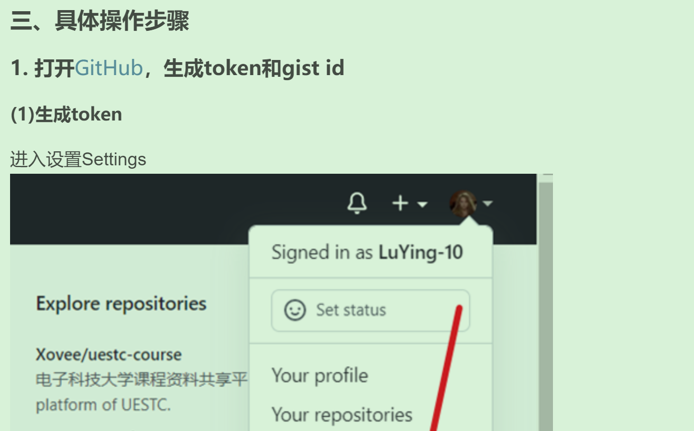
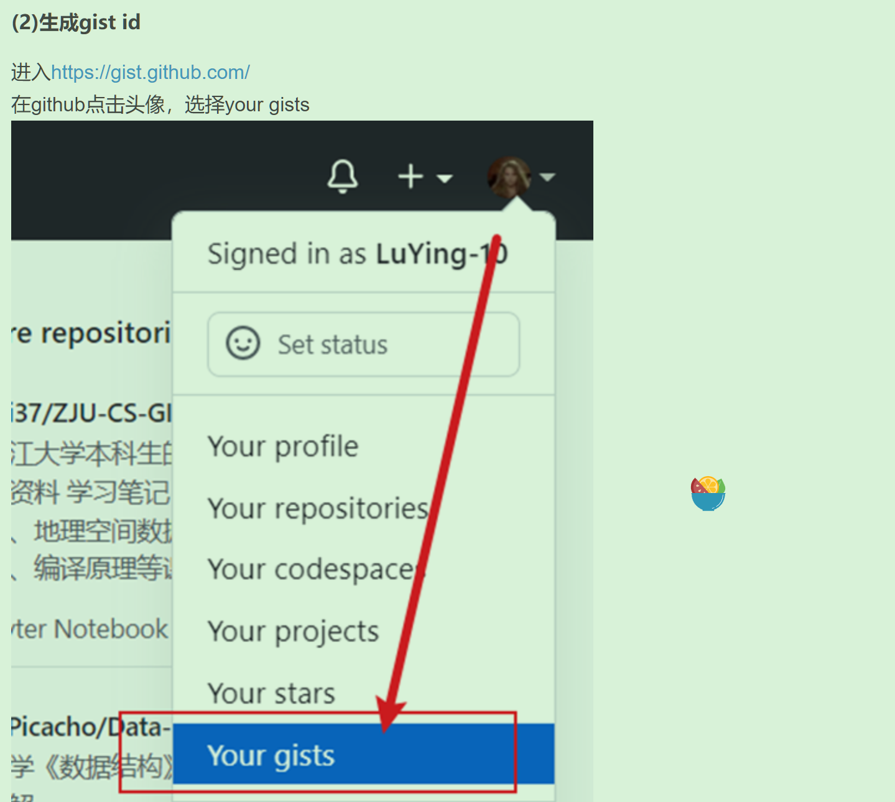
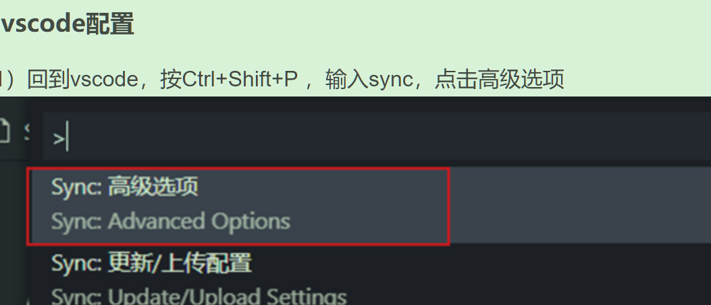
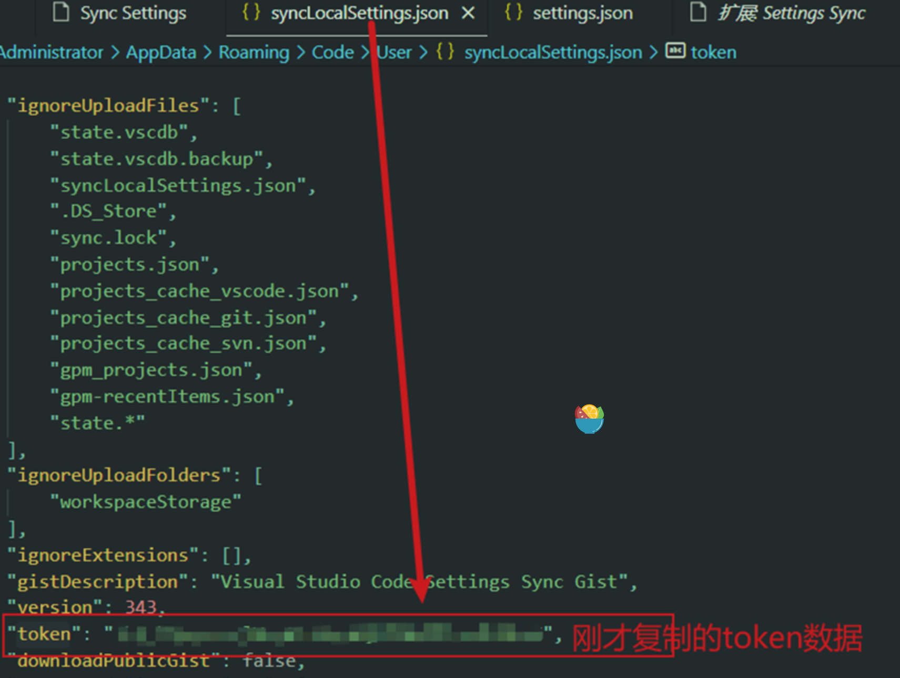
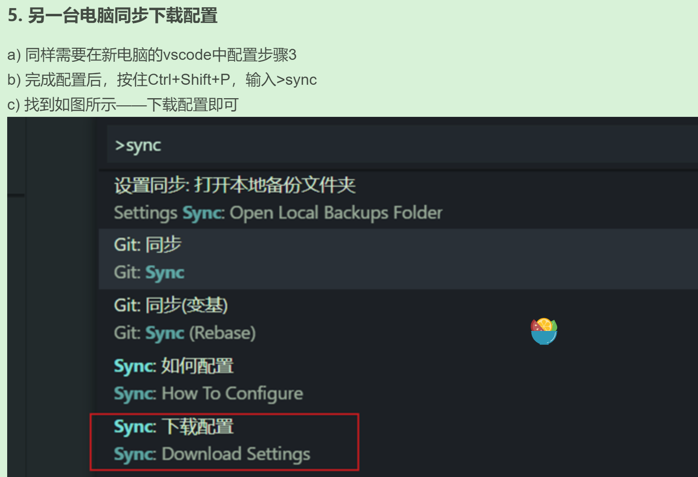

## 打开 vscode 软件

- 方法1 
<!-- 我测试 已失效 -->
1. 打开命令面板,command+shift+p
2. 输入Shell Command；
3. 此时会有提示“Shell Command: Install ‘code’ command in PATH”，运行即可；
4. 关闭vscode，直接在终端中输入code .，则打开vscode。

- 方法2
直接使用命令 code.cmd 打开

## 插件 
### settings Sync

- 通过GitHub生成你的gist Id 和 token
- 两台电脑的VSCode中都需要安装settings Sync插件并配置 gistId 和 token
- 原电脑上传配置
- 新电脑下载同步配置

### 搜索 search

