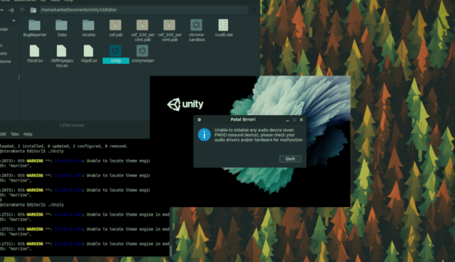

## linux



### 进程


### 工作


### 资源


### 日志


### 远程登录


### 文件


```sh
ls -l  # 显示文件
chgrp [-R] 属组名 文件名  # 更改文件归属
```


### 磁盘

``` sh
df [-ahikHTm] [目录或文件名]  #查看磁盘
du [-ahskm] 文件或目录名称  # 查看磁盘用量
mkfs [-t 文件系统格式] 装置文件名 #磁盘格式化

#磁盘挂载与卸除
mount [-t 文件系统] [-L Label名] [-o 额外选项] [-n]  装置文件名  挂载点
```

### 软件包


```sh
列出所有可更新的软件清单命令：sudo apt update
列出所有已安装的包：apt list --installed
查找软件包命令： sudo apt search <keyword>
移除软件包及配置文件: sudo apt purge <package_name>
```